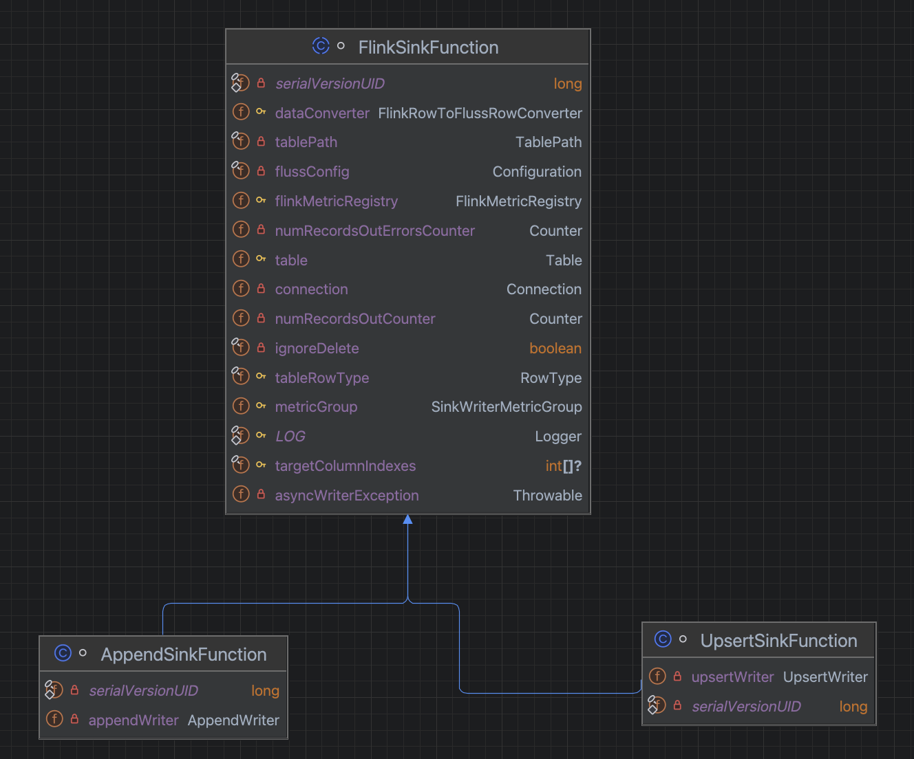
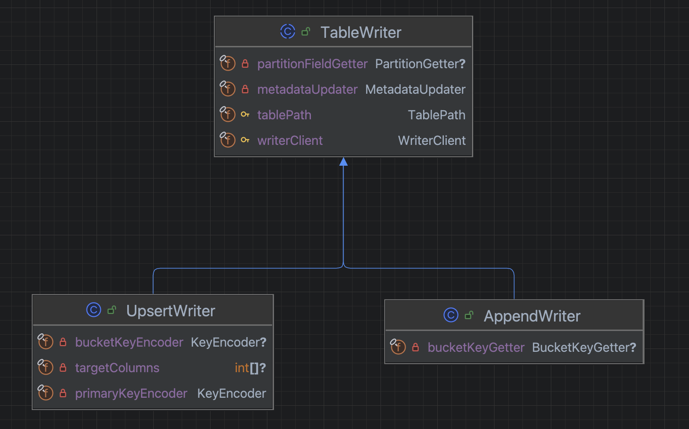
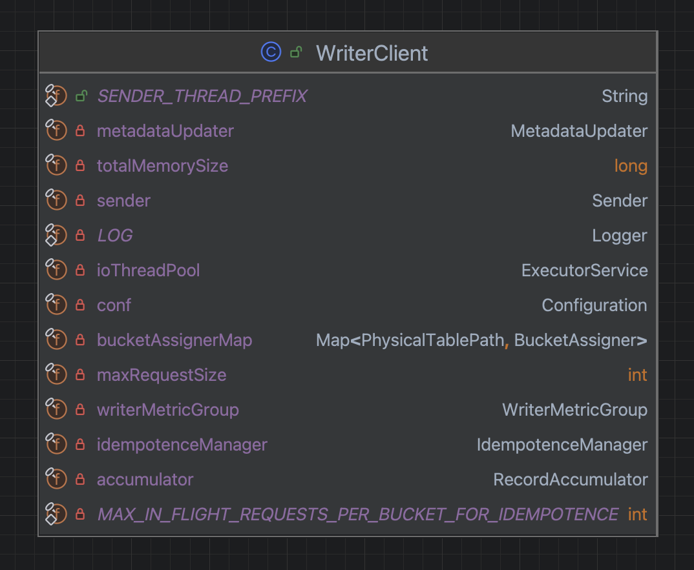
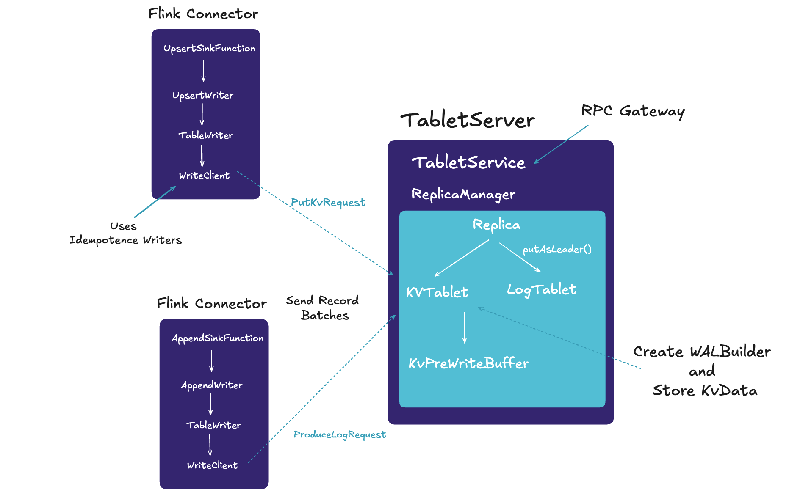
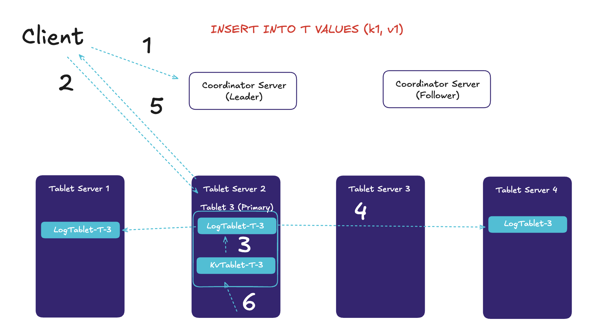
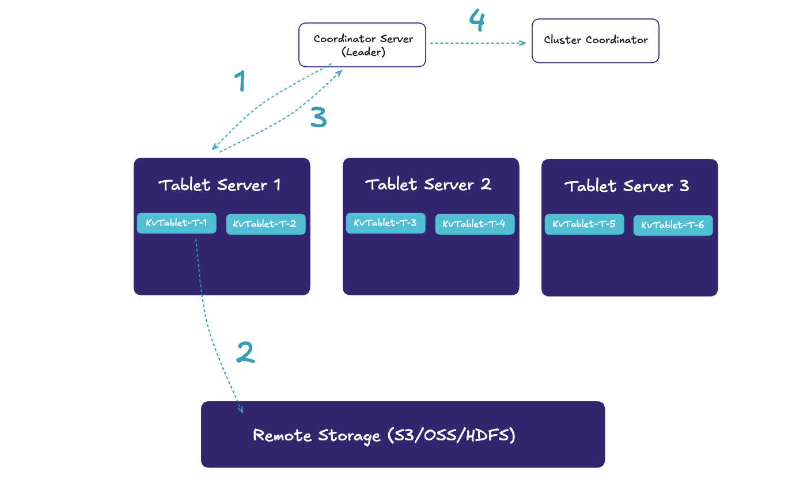

## Introduction

Fluss is an open-source streaming storage system engineered for real-time analytics, serving as a real-time data layer for Lakehouse architectures.
It bridges the gap between streaming data and data Lakehouse, in order to bring lower latencies to the data Lakehouse and better analytics to data streams.

By delving into its architecture developers can contribute to its evolution, while also understand and leverage its capabilities to build efficient, real-time data processing applications. 

This blog post aims to provide an overview of Fluss read and write paths, elucidate its data flow mechanisms, and help developers interested, understand and engage with the project.

## The Write Path
-----------------
At the heart of Fluss streaming storage lies the `LogTablet`, a foundational structure complemented by a key-value index called `KvTablet` built over the log. 
This architecture is designed to support highly efficient real-time updates. The interaction between the Log and the Kv index embodies the concept of **stream-table duality**: updates to the Kv index produce a changelog, which is then persisted to the LogTablet. In the event of a failure, the LogTablet serves as the source for recovering the KvTablet, ensuring data integrity and resilience.

To delve deeper into this architecture, let’s explore the `Flink Sink` and understand how Apache Flink writes data to Fluss.

## The Flink Sink

As depicted in the figure above, we have the `FlinkSinkFunction`, that implements the sink functionality. It is an abstract class that consists 
of two concrete implementation for handling different types of data:
- **AppendSinkFunction:** handles the writing of `append-only` data for Fluss log tables.
- **FlinkUpsertSinkFunction:** handles the writing of `upserts` for Fluss primary key tables.

Each implementation holds an instance of a **TableWriter** that comes from Fluss `client package`.

Similarly the TableWriter is an abstract class that has two concrete implementations, the `AppendWriter` and the `UpsertWriter`.
The AppendSinkFunction uses the AppendWriter, while the UpsertSinkFunction uses the UpsertWriter, for handling `append-only` data and `upserts` respectively.

The TableWriter uses the WriterClient, which is responsible for sending data to Fluss Servers, called **TabletServers**.
More specifically:
- Sending messages happens with the `send()` method that sends WriteRecords. 
- WriteRecords is a conversion from Flink's InternalRow. 
- For table with primary key, if we use the **UpsertWriter** to send record 
  - it will convert to WriteRecord with a key part, a value row part and write kind of `PUT`.  
  - For `deletes` it will convert to a WriteRecord with a key part , an empty value row and write kind WriteKind of `DELETE`. 
- For none-pk table, if we use the **AppendWriter** to send records, it will convert to a WriteRecord without key, the value row part and write kind of `APPEND`.

The writer maintains a pool of buffer space to temporarily store records that have not yet been transmitted to the TabletServer. It also includes a dedicated background I/O thread responsible for converting these records into requests and transmitting them to the cluster. Failure to close the writer after use can result in resource leaks.

The send() method operates asynchronously. When invoked, it appends the log record to a buffer of pending records and returns immediately. This approach enables the writer to batch individual records together, optimizing throughput and efficiency.

These batches can be categorized into different types, each generating a specific type of request based on the data:
- **KV Write Batch:** Generates a `PutKvRequest`, which the server processes to handle key-value (KV) data.
- **Arrow Log Write Batch or Indexed Log Write Batch:** Generates a `ProduceLogRequest`, enabling the server to handle log data, which is append-only.

By default, log data is stored in the **Arrow** format. Once batched, the requests are transmitted to the server for processing.

## The TabletServer

On the server side, the **TabletServers** manage **LogTablets** and **KvTablets** through dedicated components: the **LogManager** and **KVManager**, respectively.
The TabletServers also expose a **TabletService**, an RPC gateway that handles incoming requests such as `PutKvRequest` and `ProduceLogRequest`.

### Handling KV and Log Data Requests

The `PutKvRequest`, which is more complex, initiates the process of writing key-value (KV) data. The **TabletService** utilizes a **ReplicaManager** to manage replicas during the write process. When the method`putRecordsToKv(...)` is invoked, KV records are written to the leader replicas of the specified buckets.
The **KvTablet** handles the write operation and ensures consistency by waiting for the **WAL/changelog** (CDC) to be replicated across all replicas before sending a response. Specifically, the following steps occur in the `putAsLeader()` method:
1. **Partial Updates and other Merge Engines:** Handles partial updates or other specified merge engine, if configured.
2. **Write-Ahead Log (WAL):** Creates a WAL entry, by default in `Arrow` format, and records the following operations:`INSERT (+I)`,`UPDATE_BEFORE (-U)`,`UPDATE_AFTER (+U)`and`DELETE (-D)`.
3. **KvPreWriteBuffer:** Records are written to an in-memory pre-write buffer called KvPreWriteBuffer. This buffer temporarily stores KV records before flushing them to the underlying storage when the `flush()` method is invoked.

In Fluss, the WAL is important for maintaining consistency. When a key-value pair is written, Fluss first persists the WAL entry. Only after the WAL is successfully persisted (ensuring fault tolerance) does Fluss proceed to write the data to the KV storage. This mechanism prevents inconsistencies in the event of a failure.

For example:
- If data is written to KV storage without waiting for the WAL to persist, users could read the data prematurely.
- In the event of KV storage failure before WAL persistence, Fluss would be unable to restore the lost data from the WAL, resulting in permanent data loss despite prior reads.

The **pre-write buffer** addresses this issue by acting as an intermediary between WAL persistence and final storage.

Once the data is replicated across all replicas, acknowledgments (ACKs) are sent back to the client.

## The Read Path
In Fluss architecture, **full data** resides in RocksDB's SST files stored in remote storage, while **incremental data** is maintained as log files in the LogStore. 
By persisting the consistent offset on the LogTablet during checkpointing of the KvTablet, the system ensures seamless data retrieval. 
When switching between phases, only the incremental data in the LogStore needs to be read based on the checkpoint's offset.

### Data Retrieval Phases
**Full Data Phase**

In the full data phase, the connector leverages RocksDB's `SstFileReader` to directly access SST files stored in remote storage. Multiple SST files are merged and read while maintaining Flink checkpoints to track file locations during the processing of full data. This ensures consistency and accurate recovery.

This phase is akin to the stream-read mechanism used in `Apache Paimon`. As a simplification, the initial implementation may load data into RocksDB, albeit with potentially reduced performance and stability, to handle the full data workload.

**Incremental Phase**

The incremental phase mirrors the design of a Kafka consumer. During this phase:
- The connector identifies the appropriate **TabletServer** node using the tablet ID. 
- The TabletServer retrieves incremental log data from the LogStore based on the requested offset and transmits it to the consumer. 
- The consumer independently manages its consumption location information, ensuring precise tracking of incremental data.

**Query Pushdown**
- **Batch Query:** When a query includes a primary key (PK) or filter condition, it can be pushed down to the TabletServer. The TabletServer then performs a point query by directly retrieving the relevant results from RocksDB, significantly improving query efficiency.
- **Streaming Query:** For streaming queries that select specific columns, the TabletServer efficiently filters columns from the row-based log data. This reduces network bandwidth usage and minimizes the pressure on the TabletServer.

So, in summary the workflow involves:
1. **Full Data Access:** Reading and merging SST files from remote storage using SstFileReader.
2. **Incremental Data Access:** Fetching log data from the LogStore via TabletServer based on offsets tracked during checkpointing.
3. **Query Pushdown:** Enhancing query performance through PK-based point queries or selective column filtering in streaming scenarios.

This approach ensures a robust, scalable, and efficient data processing pipeline, effectively balancing full and incremental data retrieval with advanced query optimizations.

Let's try and visualize the process.

1. **Table Assignment Query:** The client first contacts the Coordinator Server Leader to retrieve the table assignment information for table T. This information is cached locally by the client, allowing subsequent requests to directly leverage the cached assignment to route requests to the appropriate TabletServer.
2. **Key-to-Tablet Mapping:** Based on the key (`k1`) and the bucket configuration of table `T`, the client determines that the data belongs to `Tablet3`. Using the cached assignment information, the primary replica for `Tablet3` is identified as residing on **TabletServer2 (TS2)**, and the write request is directed to TS2.
3. **Processing the Write Request:** Upon receiving the write request TS2, first queries the local **KvTablet T-3** to retrieve the existing row associated with the key, then generates the WAL/Changelog and finally writes the records to **LogTablet T-3**
4. **Data Replication:** TS2 replicates the newly written **LogTablet T-3** data to the secondary replicas located on **TabletServer4 (TS4)** and **TabletServer1 (TS1)**. Once the replication process is complete, acknowledgments (ACKs) are returned to TS2.
5. **Write Confirmation:** After TS2 collects ACKs from all replicas as defined by the replication factor, it returns a success response to the client, ensuring that the data has been fully persisted. This mechanism guarantees durability, allowing data recovery during TS or **Coordinator Server (CS)** failover.
6. **Final Row Update:** Once the data is safely persisted, TS2 writes the new row to the **KvTablet T-3**, completing the write operation.

This process ensures data durability, fault tolerance, and efficient write handling by leveraging a combination of local caching, CDC logging, and replication across TabletServers.

## Fault Tolerance & Persistence

1. **Trigger Checkpoint:** A checkpoint is initiated for KVTablet-1. 
2. **Snapshot and Upload:** A snapshot of the RocksDB state and the corresponding LogTablet offset is captured and the SST files and a metafile are uploaded to remote storage. 
3. **Acknowledge Checkpoint:** Once the snapshot and upload are complete, a checkpoint acknowledgment is returned for KVTablet-1, including the checkpoint's path. 
4. **Persist Checkpoint Path:** The checkpoint path for Tablet-1 is stored in the cluster coordinator to ensure it is accessible for future recovery.

The checkpointing mechanism for **KVTablet (RocksDB)** adopts an incremental checkpointing strategy, similar to Apache Flink, minimizing data transmission and storage overhead by only transmitting changes since the last checkpoint.

During restoration, the **TabletServer** hosting the new primary **LogTablet** retrieves the checkpoint path from the cluster coordinator, downloads the SST files for the KVTablet from remote storage, and restores the KVTablet state. 
The **LogTablet** then applies any incremental log data from the stored offset, bringing the KVTablet to its latest state. 
Once restored, the Tablet is made available for external use, ensuring efficient recovery and data consistency.

## Conclusion
We explored some of Fluss components, including the write/read paths and fault-tolerance mechanisms, as this blog aims to help developers better understand it's internals.

For engineers building real-time data processing pipelines, Fluss provides a robust and scalable foundation, particularly in conjunction with Apache Flink. For open-source contributors, it represents an exciting opportunity to engage with and shape an evolving technology designed for modern data challenges.

Whether you’re looking to adopt Fluss for its technical capabilities or contribute to its growth as part of the community, Fluss offers a platform to build next-generation real-time applications with confidence. 

Join the Fluss community and help drive the future of real-time data processing.

