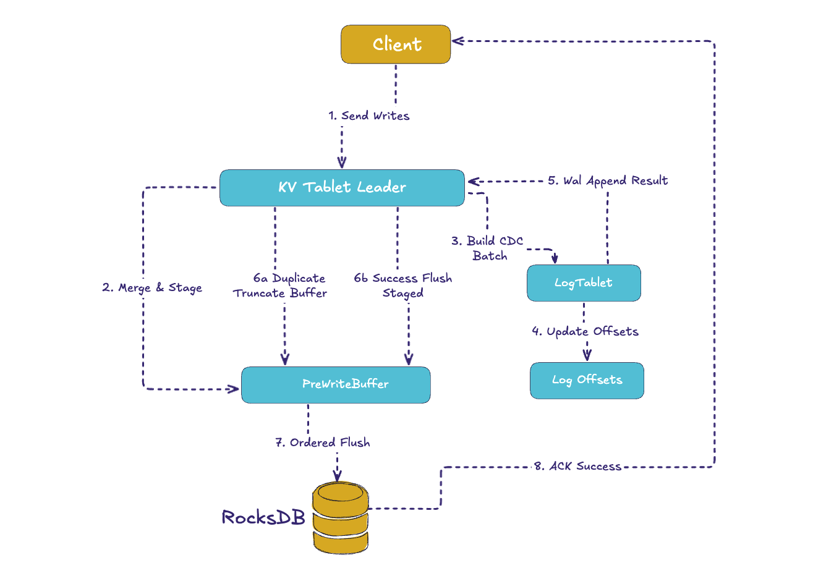
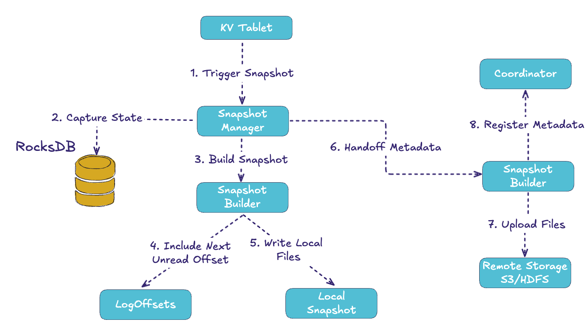

Modern data platforms have traditionally relied on two foundational components: a **log** for durable, ordered event storage and a **cache** for low-latency access. Common architectures include combinations such as Kafka with Redis, or Debezium feeding changes into a key-value store. While these patterns underpin a significant portion of production infrastructure, they also introduce **complexity**, **fragility**, and **operational overhead**.

Apache Fluss addresses this challenge with an elegant solution: **Primary Key Tables (PK Tables)**. This feature unifies log and cache into a single, cohesive design. Each write not only generates a durable log event but also ensures a consistent update in the built-in cache (RocksDB). Deterministic recovery is guaranteed through snapshots and log replay, while clients benefit from the simplicity of interacting with one system for reads, writes, and operations.

In this post, we will explore how Fluss PK Tables work, why unifying log and cache is a critical advancement, and how this design resolves long-standing challenges of maintaining consistency between logs and caches.

<!-- truncate -->

## 🚧 The Log–Cache Separation

Before diving into how Fluss works, it’s worth pausing on the traditional architecture: a log (like Kafka) paired with a cache (like Redis or Memcached). This pattern has been incredibly successful, but anyone who has operated it in production knows the headaches.

The biggest challenge is **cache invalidation**. Writes usually flow to the database or log first, and then the cache has to be updated or invalidated. In practice, this often creates timing windows: the log might show an update that the cache hasn’t yet applied, or the cache may return stale data long after it should have expired. Teams fight this with TTLs, background refresh daemons, or CDC-based updaters, but no solution is perfect. Staleness is a fact of life.

Another pain point is **dual writes and atomicity**. Applications frequently need to update both the log and the cache (or log and DB, then cache). Without careful orchestration, often using an outbox pattern or distributed transactions, it’s easy to end up with mismatches. For example, the cache may be updated with a value that never made it into the log, or vice versa. This not only creates correctness issues but also makes recovery from failure very hard.

Operationally, running two systems is simply heavier. You need to deploy, monitor, scale, and secure both the log and the cache. Each comes with its own tuning knobs, resource usage patterns, and failure modes. When things go wrong, debugging is often about figuring out which system is “telling the truth.”

Finally, **failover** and **recovery** are fragile in a dual-system world. If the cache cluster restarts, you might start from empty and experience surges as clients repopulate hot keys. If the log has advanced while the cache is empty, reconciling the two can be messy. The promise of “fast reads and durable history” often comes with the hidden cost of reconciliation and re-warming.

This is the context Fluss was designed for. The goal is not to reinvent the wheel but to **unify the log and the cache into one coherent system** where writes, reads, and recovery all flow through the same consistent pipeline.

## TL/DR
The **Key-Value (KV) store** forms the foundation of the **Primary Key (PK) tables** in Apache Fluss. Each **KVTablet** (representing a table bucket or partition), combines a **RocksDB** instance with an in-memory pre-write buffer. 
Leaders merge incoming upserts and deletes into the latest value, then construct **CDC/WAL batches** (typically in Apache Arrow format) and append them to the log tablet. Only after this step is the buffered KV state flushed into RocksDB, ensuring strict **read-after-log correctness**.

Snapshots are created incrementally from RocksDB and uploaded to remote storage, enabling efficient state recovery and durability.

## Inside Fluss PK Tables
### 🔑 Fluss PK Tables: The Unified Model
In Fluss, a Primary Key Table consists of several tightly integrated components:
* **KvTablet:** in the Tablet Server stages and merges writes, appends to the log, and flushes to RocksDB. 
* **PreWriteBuffer:** is an in-memory staging area that ensures writes line up with their log offsets. 
* **LogTablet:** is the append-only changelog, feeding downstream consumers and acting as the durable history. 
* **RocksDB:** is the embedded key-value store that acts as the cache, always kept consistent with the log. 
* **Snapshot Manager and Uploader:** periodically capture RocksDB state and upload it to remote object storage like S3 or HDFS. 
* **Coordinator:** tracks metadata such as which snapshot belongs to which offset.

* Together, these components give Fluss the power of a log and a cache without the pain of reconciling them.

### ✍️ The Write Path
The write path is where Fluss’s guarantees come from. The ordering is strict: append to the log first, flush to RocksDB second, and acknowledge the client last. This removes the classic inconsistency where the log shows a change but the cache doesn’t.

Here’s how the flow looks across the key components:

When a client writes to a KV table, the request first lands in the **KvTablet**. 
Each record is merged with any existing value (using a **RowMerger** so Fluss can support last-write-wins or partial updates). At the same time, a CDC event is created and added to the **log tablet**, ensuring downstream consumers always see ordered updates.

But before these changes are visible, they’re staged in a **pre-write buffer**. This buffer keeps operations aligned with their intended log offsets. Once the WAL append succeeds, the buffer is flushed into RocksDB. This order – WAL first, KV flush after –  guarantees that if you see a change in the log, you can also read it back from the table. That’s what makes lookup joins, caches, and CDC so reliable.

Duplicate protection is built in: if a batch with the same writer ID and sequence number arrives twice, Fluss simply truncates the buffer back to the last good offset and acknowledges it, avoiding double application. ✅

**In a nutshell:** Every write flows through a single path, producing both a log event and a cache update. Because acknowledgment comes only after RocksDB is durable, clients are guaranteed read-your-write consistency.

### 📸 The Snapshot Process
A running leader can’t rely only on logs. If logs grow forever, recovery would be extremely slow. 
That’s where **snapshots** come in. Periodically, the **snapshot manager** inside the tablet server captures a consistent checkpoint of RocksDB. It tags this snapshot with the **next unread log offset**, which is the exact point from which replay should resume later.

The snapshot is written locally, then handed off to the **uploader**, which sends the files to **remote storage** (S3, HDFS, etc.) and registers metadata in the **Coordinator**. Remote storage applies retention rules so only a handful of snapshots are kept.

This means there’s always a durable, recoverable copy of the state sitting in object storage, complete with the exact log position to continue from.

Snapshots make the system resilient. Instead of reprocessing an entire log, a recovering node can start from the latest snapshot and replay only the logs after the recorded offset. This reduces recovery time dramatically while ensuring correctness.

### ⚡ Failover and Recovery

When a leader crashes, Fluss promotes a follower to leader. Followers are log-only today (no hot RocksDB), so the new leader must:
1. Fetch snapshot metadata from the coordinator. 
2. Download the snapshot files from remote storage. 
3. Restore RocksDB from that snapshot. 
4. Replay log entries since the snapshot offset. 
5. Resume serving reads and writes once KV is in sync.

This process ensures determinism: the snapshot defines the starting state, and the log offset defines exactly where replay begins. Recovery may not be instantaneous, but it is safe, automated, and predictable. Work is underway to add hot-standby RocksDB replicas to make this even faster.

**Note:** For a large table, the recovery process might take even up to minutes, which might not be acceptable in many scenarios. To solve this issue, the Apache Fluss community will introduce a standby replica mechanism (see more [here](https://cwiki.apache.org/confluence/display/FLUSS/FlP-13%3A+Support+rebalance+for+PrimaryKey+Table)), so recovery can happen instantaneously. This feature will be introduced in the upcoming 0.8 release.

### ⚡ The Built-In Cache Advantage
What makes Fluss PK Tables really stand out is that the **cache is not an external system**. Because RocksDB sits right inside the TabletServer and is updated in lockstep with the WAL, you never have to worry about invalidation.

This means:
* No race conditions where the log is ahead of the cache. 
* No cache stampedes on restart, because RocksDB is restored from snapshots deterministically. 
* No operational overhead of scaling, securing, and reconciling an external cache cluster.

Instead of a patchwork of log & DB & cache, you just have Fluss. The log is your history, the KV is your current state, and the system guarantees they never drift apart.

By unifying the log and the cache into one design, Fluss solves problems that have plagued distributed systems for years. Developers no longer have to choose between correctness and performance, or spend weeks debugging mismatches between systems. Operators no longer need to run and tune two separate clusters.

For real-time analytics, AI/ML feature stores, or transactional streaming apps, the result is powerful: every update is both an event in a durable log and a fresh entry in a low-latency cache. Recovery is automated, consistency is guaranteed, and the architecture is simpler.

### 🚀 Closing Thoughts
Fluss Primary Key Tables are one of the most compelling features of the platform. They embody the **stream-table duality** in practice: every write is a log entry and a KV update; every recovery is a snapshot plus replay; every cache read is guaranteed to be consistent with the log.

The complexity of coordinating a log and a cache disappears. With Fluss, you don’t have to choose between speed and safety; you get both.

In short, **Fluss turns the log into your cache, and the cache into your log**, which can be a major simplification for anyone building real-time systems.

And before you go 😊 don’t forget to give Fluss 🌊 some ❤️ via ⭐ on [GitHub](https://github.com/apache/fluss)

### 🎉  Additional Resources
* Sample app for real-time dashboards, powered by Fluss PK Tables: https://github.com/ververica/ververica-fluss-examples/tree/main/fluss-food-delivery