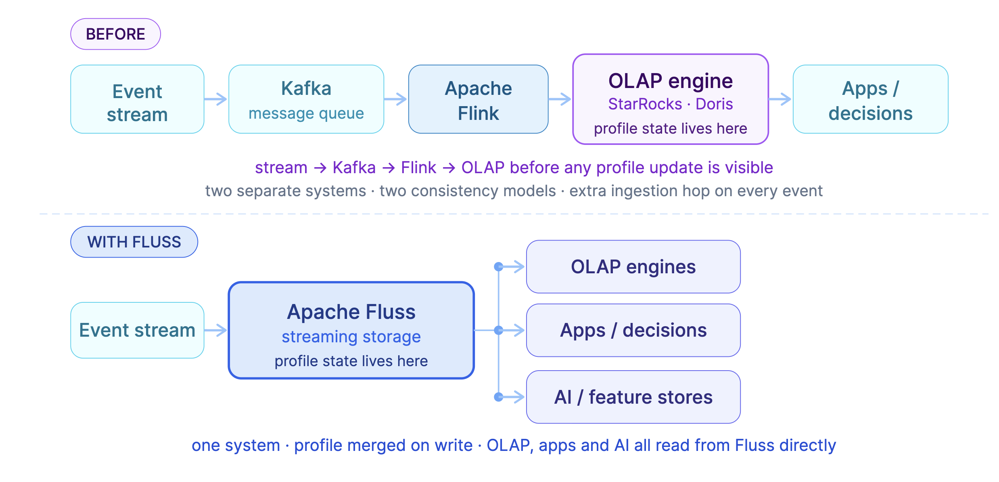
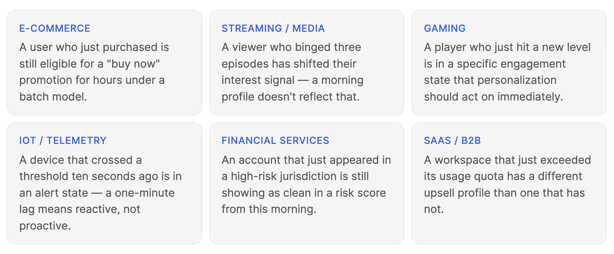
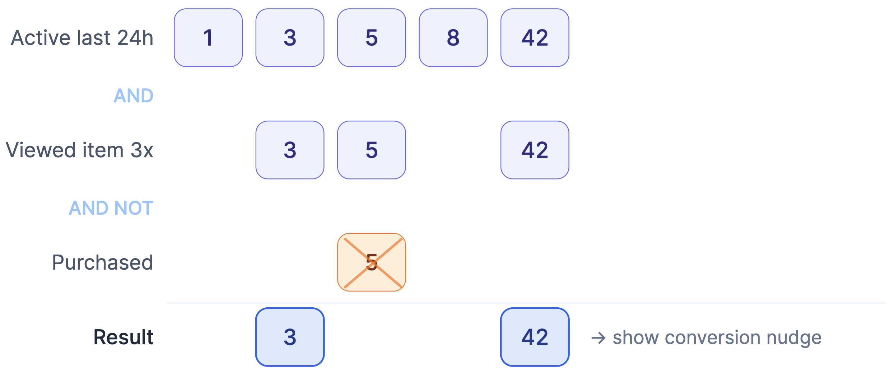
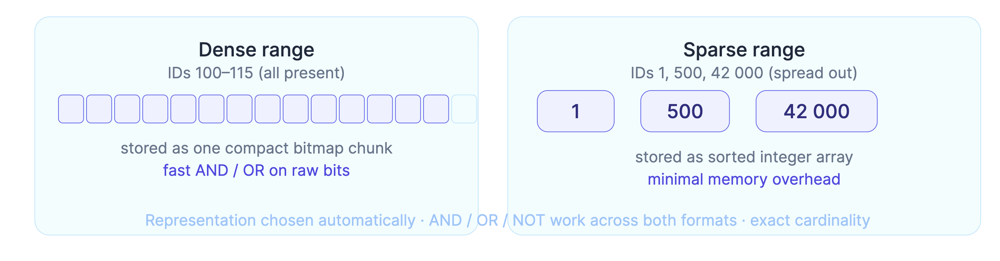
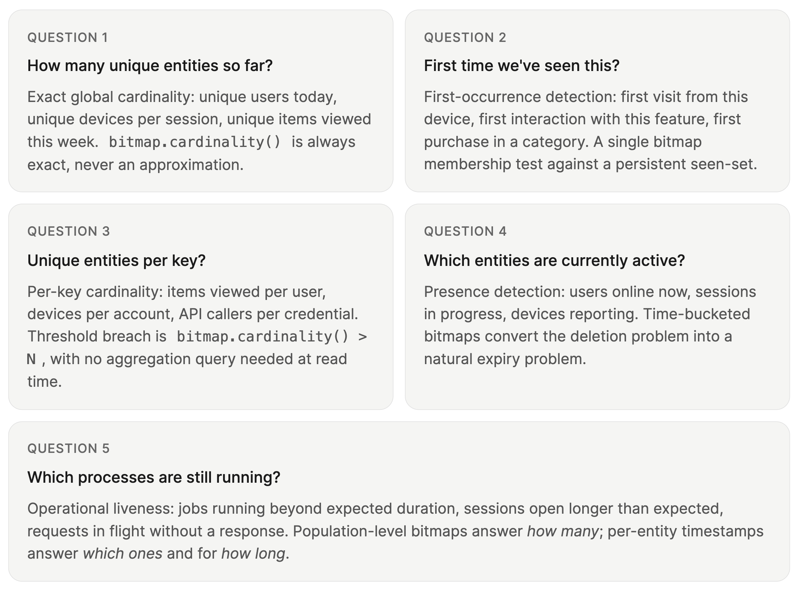
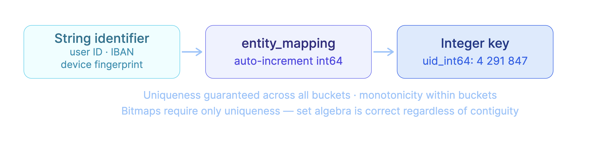
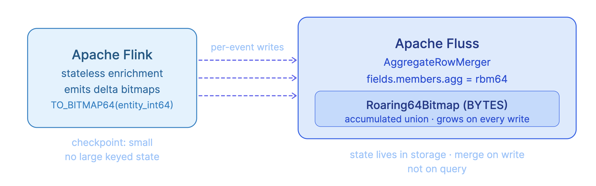
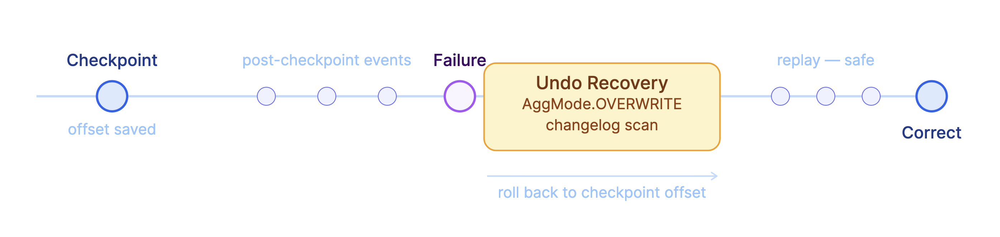
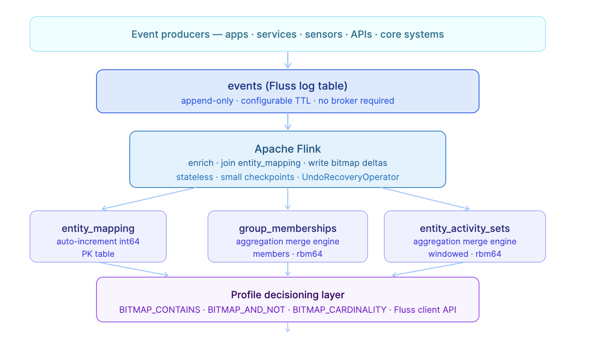
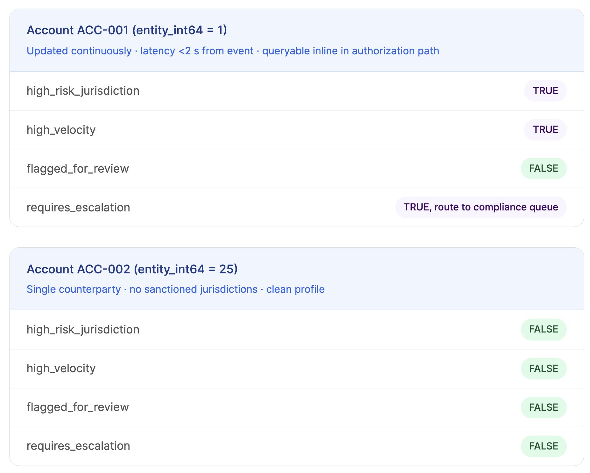

## From Events To Real-Time Profiles On Apache Fluss
Every system that makes decisions about users, devices, sessions, or transactions is ultimately trying to answer a version of the same question:

> What do we know about this entity right now and does it change what we should do next?

Modern data platforms are good at collecting the signals that feed that question: clicks, purchases, logins, sensor readings, API calls, session events. 
The challenge is acting on them immediately: while a user is browsing, a session is active, a device is online, a transaction is in-flight,
so that decisions feel current rather than stale.

### How Real-Time Profiles Were Created So Far
Real-time entity profiles are one of the most critical streaming analytics use cases. 

Until recently, the dominant approach for serving them was to push event data into an OLAP engine,
systems like `StarRocks`, `Apache Doris`, or `ClickHouse` and rely on their low-latency query capabilities 
to answer profile questions against recently ingested data. 

This works, but it **introduces a fundamental architectural tension:** the profile state lives in the query layer, not in the streaming storage layer. 
Every profile read is a query. 
Every update requires the event to travel from the stream, through ingestion, into the OLAP store, before it is visible. 
The streaming layer and the profile layer are separate systems with separate consistency models.


<!-- truncate -->
### What Fluss Changes?
Fluss shifts profile state into the streaming storage layer itself. 
Instead of ingesting events into a stream and separately querying an OLAP engine for the current profile, 
the profile is maintained inside Fluss as events arrive, using the Aggregation Merge Engine to merge bitmap state directly on write. 
The stream and the profile are the same system, with the same consistency model and the same recovery guarantees.

This has a meaningful downstream effect: any consumer that can read Fluss gets profiles for free. 
An OLAP engine like StarRocks or DuckDB can query the profile tables directly, nothing changes about how they work,
they simply no longer have to own the profile state. 

AI applications and feature stores can read the same bitmap-structured groups for real-time feature serving. 
The streaming pipeline, the analytical layer, and the AI layer all see the same continuously updated view.

This post explains how to build that infrastructure. Three pieces fit together:
* **Auto-Increment Columns:** map arbitrary string identifiers into stable integers suitable for bitmap analytics
* **Roaring Bitmaps:** compressed, high-performance set representations for large-scale membership tests and set combination 
* **The Aggregation Merge Engine:** a storage-layer merge engine that maintains aggregated state per primary key with replay-safe recovery

Why Real-Time Profiles Are Important
Batch-computed profiles, which refreshed nightly, hourly, or every few minutes are the dominant pattern in most data platforms today.
The architecture is familiar: a scheduled job re-aggregates history and overwrites a profile store. 
It works until the cost of latency becomes visible.



### Modeling Activity As Groups: The core Abstraction
When we observe entity activity over time, we naturally accumulate collections of entities sharing something in common: 
users who clicked a product in the last 10 minutes, devices seen on more than one account, sessions still active, accounts that crossed a usage threshold today. 
Each collection is a **group of integer-identified entities**. 
Once expressed this way, profile rules become set algebra.



Profile rules frequently reduce to set membership and set algebra: AND, OR, AND NOT. The remaining engineering questions are how to store these sets at scale, update them continuously, and combine them fast enough for inline use. That is where Roaring Bitmaps enter.

### Roaring Bitmaps: Compressed Set Analytics At Scale
A bitmap maps each entity ID to a single bit, on if present, off if not. 
Membership, union, intersection, and difference all become single CPU instructions. 
The problem: large or sparse ID spaces waste enormous memory. 
A Roaring Bitmap solves this by selecting its internal storage representation automatically.



For profile systems this means: group membership across millions of users can be stored and queried at compressed scale with exact cardinality counts.
Whether the requirement is "users who clicked in the last 10 minutes" or "devices seen on more than one account," bitmap operations resolve in nanoseconds.

### Five Streaming Analytics Questions That Drive Real-time Profiles
Before building an example, it is worth naming the five questions that real-time profiles need to answer. 
They are general across domains, and the same three-layer infrastructure serves all of them.



### Mapping Entity Identifiers To Integers
Roaring Bitmaps require integer IDs.
Real-world identifiers, like user IDs, device fingerprints, session tokens, account numbers which are almost always strings. 
Fluss auto-increment columns solve this: map string identifiers to stable 64-bit integers in a dimension table and use those integers everywhere downstream.



```sql
CREATE TABLE entity_mapping (
  entity_id     STRING,
  entity_type   STRING,   -- 'user' | 'device' | 'session' | 'account' | ...
  entity_int64  BIGINT,
  PRIMARY KEY (entity_id, entity_type) NOT ENFORCED
) WITH (
  'auto-increment.fields'          = 'entity_int64',
  'lookup.insert-if-not-exists'    = 'true',
  'lookup.cache'                   = 'PARTIAL',
  'lookup.partial-cache.max-rows'  = '500000',
  'lookup.partial-cache.expire-after-write' = '1h',
  'table.auto-increment.cache-size' = '100000',
  'bucket.num'                     = '3'
);
```


### The Aggregation Merge Engine: State In Storage, Not In Compute
With IDs mapped to integers, we can represent groups as bitmaps. 
Keeping those bitmaps updated in real time without a massive stateful Flink job is the core architectural challenge. 
The Aggregation Merge Engine moves that work into Fluss storage.


Each write from Flink carries a single-element BYTES bitmap produced by `TO_BITMAP64(entity_int64)`. 
Fluss merges these into the accumulated group bitmap via the rbm64 aggregator at the storage layer. 
The Flink job holds almost no state, checkpoints stay small regardless of how many entities are tracked.

> **Column type:** The rbm64 and rbm32 aggregators require the column type to be BYTES, not VARBINARY. VARBINARY is explicitly unsupported and will throw at table creation time.

### Recovery Semantics: Correct Results Across Failures And Replays
When Flink fails and replays data, double-counted increments produce incorrect aggregates, false threshold breaches, inflated counts, wrong group memberships. 
The Aggregation Merge Engine addresses this through a recovery mechanism in the Flink connector layer.



When the Flink sink restarts, the `UndoRecoveryOperator` compares bucket offsets from the checkpoint against current log end offsets. 
For buckets with post-checkpoint writes, it scans the changelog, computes per-key inverse operations, and applies them via `AggMode.OVERWRITE`, bypassing the merge engine and directly restoring prior state. 
For failure before the first checkpoint, a producer offset snapshot registered at job startup provides the rollback baseline.

### Show Me The Code 👨‍💻-- Real-time Risk Profiles In Financial Services

> The complete working example, Docker setup, and all source code are available in the
> [github repository](https://github.com/ververica/ververica-fluss-examples/tree/main/realtime_profiles) 
> along with a [detailed guide](https://github.com/ververica/ververica-fluss-examples/blob/main/realtime_profiles/guide.md).




#### Step 1: Register the Fluss catalog

```sql
CREATE CATALOG fluss_catalog WITH (
  'type'              = 'fluss',
  'bootstrap.servers' = 'coordinator-server:9123'
);

USE CATALOG fluss_catalog;
```

#### Register the bitmap UDFs before use:

```sql
ADD JAR '/opt/flink/jars/fluss-flink-realtime-profile-0.1.0.jar';

CREATE TEMPORARY FUNCTION to_bitmap64        AS 'io.ipolyzos.udfs.ToBitmap64';
CREATE TEMPORARY FUNCTION bitmap_contains    AS 'io.ipolyzos.udfs.BitmapContains';
CREATE TEMPORARY FUNCTION bitmap_cardinality AS 'io.ipolyzos.udfs.BitmapCardinality';
CREATE TEMPORARY FUNCTION bitmap_or          AS 'io.ipolyzos.udfs.BitmapOr';
CREATE TEMPORARY FUNCTION bitmap_and_not     AS 'io.ipolyzos.udfs.BitmapAndNot';
CREATE TEMPORARY FUNCTION bitmap_or_agg      AS 'io.ipolyzos.udfs.BitmapOrAgg';
CREATE TEMPORARY FUNCTION bitmap_to_string   AS 'io.ipolyzos.udfs.BitmapToString';
```

---

#### Step 2: The input event stream as a Fluss log table

```sql
CREATE TABLE transaction_events (
    account_id        STRING,
    counterparty_id   STRING,
    jurisdiction_code STRING,
    channel           STRING,
    amount_eur        DECIMAL(18, 2),
    event_type        STRING,
    ts                TIMESTAMP(3),
    WATERMARK FOR ts AS ts - INTERVAL '5' SECOND
) WITH (
    'table.log.ttl' = '7d',
    'bucket.num'    = '8'
);
```

---

#### Step 3: Entity mapping with auto-increment integers

```sql
CREATE TABLE entity_mapping (
    entity_id     STRING NOT NULL,
    entity_type   STRING NOT NULL,
    entity_int64  BIGINT,
    PRIMARY KEY (entity_id, entity_type) NOT ENFORCED
) WITH (
    'auto-increment.fields'                   = 'entity_int64',
    'lookup.insert-if-not-exists'             = 'true',
    'lookup.cache'                            = 'PARTIAL',
    'lookup.partial-cache.max-rows'           = '500000',
    'lookup.partial-cache.expire-after-write' = '1h',
    'bucket.num'                              = '4'
);
```

---

#### Step 4: Enriched events table

```sql
CREATE TABLE enriched_transactions (
    account_id         STRING,
    account_int64      BIGINT,
    counterparty_id    STRING,
    counterparty_int64 BIGINT,
    jurisdiction_code  STRING,
    channel            STRING,
    amount_eur         DECIMAL(18, 2),
    event_type         STRING,
    ts                 TIMESTAMP(3),
    WATERMARK FOR ts AS ts - INTERVAL '5' SECOND
) WITH (
    'table.log.ttl' = '7d',
    'bucket.num'    = '4'
);
```

Populate it via a temporal lookup join that resolves entity IDs inline and registers unknown
entities on first encounter:

```sql
INSERT INTO enriched_transactions
SELECT
    t.account_id,
    a.entity_int64      AS account_int64,
    t.counterparty_id,
    c.entity_int64      AS counterparty_int64,
    t.jurisdiction_code,
    t.channel,
    t.amount_eur,
    t.event_type,
    t.ts
FROM (SELECT *, proctime() AS ptime FROM transaction_events) AS t
JOIN entity_mapping FOR SYSTEM_TIME AS OF t.ptime AS a
  ON t.account_id = a.entity_id AND a.entity_type = 'account'
JOIN entity_mapping FOR SYSTEM_TIME AS OF t.ptime AS c
  ON t.counterparty_id = c.entity_id AND c.entity_type = 'counterparty';
```

---

#### Step 5: The risk groups table (Aggregation Merge Engine)

```sql
CREATE TABLE risk_groups (
  group_key      STRING,
  members        BYTES,
  last_update_ts TIMESTAMP(3),
  PRIMARY KEY (group_key) NOT ENFORCED
) WITH (
  'table.merge-engine'         = 'aggregation',
  'fields.members.agg'         = 'rbm64',
  'fields.last_update_ts.agg'  = 'last_value_ignore_nulls',
  'bucket.num'                 = '3'
);
```

Inspect the bitmap contents:

```sql
SELECT
    group_key,
    bitmap_to_string(members) AS members,
    last_update_ts
FROM risk_groups;
```

---

#### Step 6: Writing high-risk jurisdiction group updates

Each event writes a single-element bitmap. Fluss handles accumulation via `rbm64` at the
storage layer — no windowed aggregation required in Flink.

```sql
INSERT INTO risk_groups
SELECT
  CONCAT('high_risk_jurisdiction:', jurisdiction_code)  AS group_key,
  to_bitmap64(account_int64)                            AS members,
  ts                                                    AS last_update_ts
FROM enriched_transactions
WHERE jurisdiction_code IN ('IR', 'KP', 'SY', 'CU', 'VE')
  AND event_type IN ('debit', 'credit');
```

---

### Step 7: Writing counterparty velocity group updates

**Pipeline A:** Accumulate per-account counterparty bitmaps per 24h tumbling window:

```sql
CREATE TABLE account_counterparty_sets (
  window_start    TIMESTAMP(3),
  account_int64   BIGINT,
  counterparties  BYTES,
  last_update_ts  TIMESTAMP(3),
  PRIMARY KEY (window_start, account_int64) NOT ENFORCED
) WITH (
  'table.merge-engine'        = 'aggregation',
  'fields.counterparties.agg' = 'rbm64',
  'fields.last_update_ts.agg' = 'last_value_ignore_nulls',
  'bucket.num'                = '3'
);

INSERT INTO account_counterparty_sets
SELECT
  TUMBLE_START(ts, INTERVAL '24' HOUR)           AS window_start,
  account_int64,
  bitmap_or_agg(to_bitmap64(counterparty_int64)) AS counterparties,
  MAX(ts)                                        AS last_update_ts
FROM enriched_transactions
GROUP BY
  TUMBLE(ts, INTERVAL '24' HOUR),
  account_int64;
```

**Pipeline B:** Detect velocity breaches and write directly to `risk_groups`:

```sql
INSERT INTO risk_groups
SELECT
  'velocity_breach:24h'                      AS group_key,
  to_bitmap64(account_int64)                 AS members,
  TUMBLE_END(ts, INTERVAL '24' HOUR)         AS last_update_ts
FROM enriched_transactions
GROUP BY
  TUMBLE(ts, INTERVAL '24' HOUR),
  account_int64
HAVING COUNT(DISTINCT counterparty_int64) > 10;
```

Advance the watermark to close the window (insert after both pipeline jobs are running):

```sql
INSERT INTO transaction_events VALUES
  ('ACC-001', 'CP-IBAN-001', 'DE', 'sepa', 0.00, 'watermark_flush', TIMESTAMP '2026-03-16 00:01:00');
```

---

### Step 8: Deriving the client risk profile via set algebra

```sql
-- Replace CAST(1 AS BIGINT) with the account's entity_int64 from entity_mapping.
SELECT
  a.id                                                                  AS account_id,
  COALESCE(bitmap_contains(hj.members, a.id), FALSE)                    AS high_risk_jurisdiction,
  COALESCE(bitmap_contains(vb.members, a.id), FALSE)                    AS high_velocity,
  COALESCE(bitmap_contains(fr.members, a.id), FALSE)                    AS flagged_for_review,
  COALESCE(bitmap_contains(hj.members, a.id), FALSE)
    OR COALESCE(bitmap_contains(vb.members, a.id), FALSE)               AS risk_signal_active,
  (COALESCE(bitmap_contains(hj.members, a.id), FALSE)
    OR  COALESCE(bitmap_contains(vb.members, a.id), FALSE))
    AND NOT COALESCE(bitmap_contains(fr.members, a.id), FALSE)          AS requires_escalation
FROM
  (VALUES (CAST(1 AS BIGINT)))                                          AS a(id)
CROSS JOIN
  (SELECT bitmap_or_agg(members) AS members
   FROM risk_groups
   WHERE group_key LIKE 'high_risk_jurisdiction:%')                     AS hj
LEFT JOIN (SELECT members FROM risk_groups WHERE group_key = 'velocity_breach:24h') AS vb ON TRUE
LEFT JOIN (SELECT members FROM risk_groups WHERE group_key = 'under_review')         AS fr ON TRUE;
```

### Flagged Profiles



### What You End Up With
Real-time entity profiles are not a separate system that gets batch-refreshed. 
They are a continuous view over group membership state that Fluss maintains incrementally, merges correctly, and serves with the latency that inline decisioning requires. 

The three components work together:
* **Auto-increment integer mapping** turns arbitrary string identifiers into the integer space bitmaps require, with inline registration via the lookup join
* **Roaring Bitmaps** give compressed, exact-count set representations for entity populations that can reach hundreds of millions of members
* **The Aggregation Merge Engine** gives those sets a storage-layer home with correct semantics for incremental updates and replay-safe recovery — driven by the Flink connector's UndoRecoveryOperator

The result is a profile infrastructure that answers "what do we know about this entity right now?" with data that is seconds old instead of hours old, applicable wherever events drive decisions, and correct under the failure conditions that production streaming systems encounter every day.
