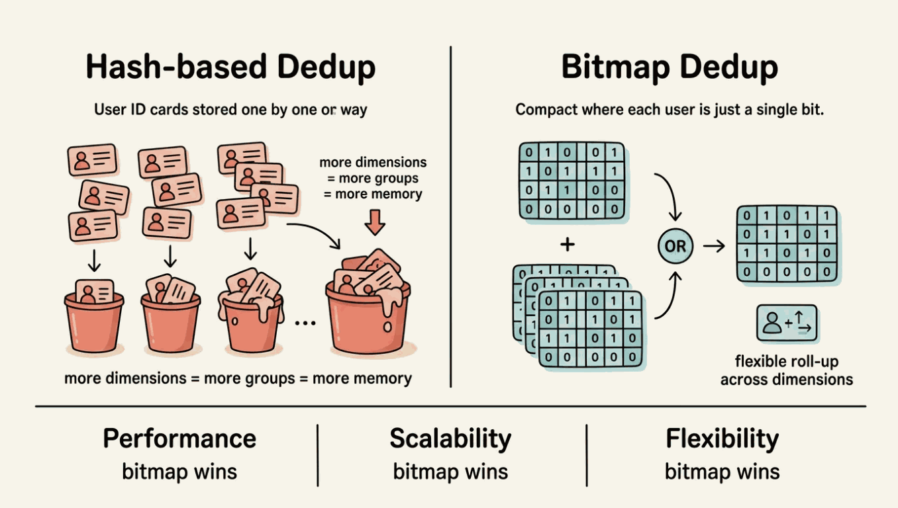
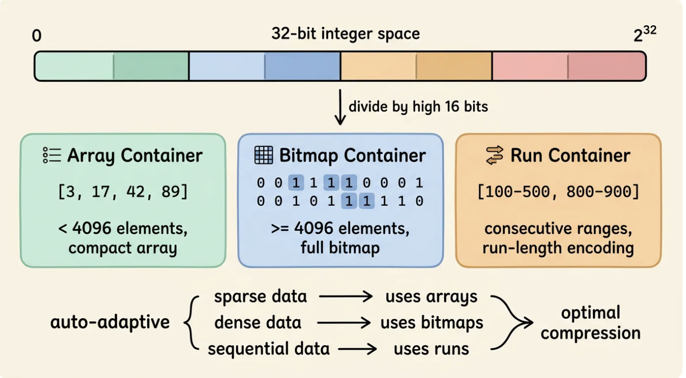
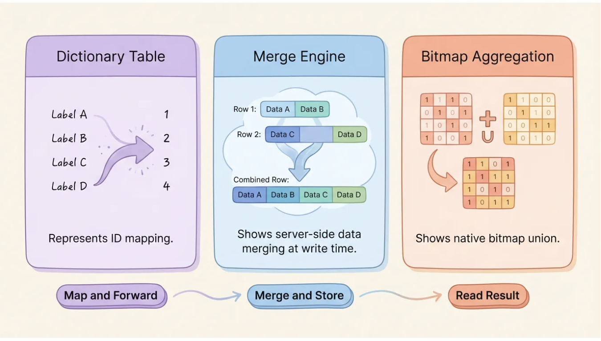
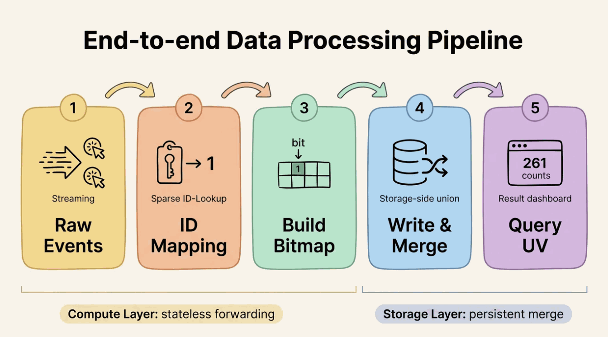
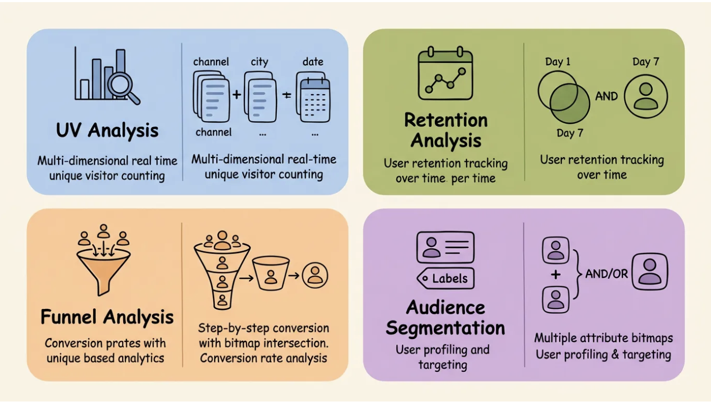

**UV (Unique Visitors)** measures the count of distinct users who visited a page or triggered an event within a given time window — unlike **PV (Page Views)**, which counts every request regardless of who made it. For any product or platform, accurate real-time UV statistics across dimensions like channel, city, date, and hour are a core analytical requirement.
The full combination of four dimensions means **16 grouping methods**; when the dimension count increases to seven, the number of possible groupings reaches **128**.

How can multi-dimensional deduplication be both accurate and flexible while maintaining real-time performance? Behind this challenge lie two very different computing paradigms: direct deduplication of raw data, or set operations based on bitmaps.

## Problems with Traditional Deduplication Schemes

Direct deduplication of raw data (e.g. `COUNT(DISTINCT user_id)`) is the most intuitive and accurate deduplication method: maintain a **hash set** for each dimension combination and record all user IDs that have appeared under the group.

This approach works well with smaller data volumes and fewer dimensions, but as business scale grows, three core limitations emerge.

**Performance increases linearly with the amount of data.** Each dimension combination needs to independently store all user identities that have occurred. When daily page view logs reach billions and distinct users number in the tens or hundreds of millions, each group's hash set demands significant memory and CPU for insertion and lookup. Total compute cost scales with the product of dimension combinations and data volume, which is especially noticeable during peak periods.

**Multidimensional extensibility is limited.** If an analyst needs UV by **Channel x City** and **Channel x Date**, the traditional scheme must calculate two separate deduplication results. The existing **Channel x City** result cannot be rolled up to get the **Channel**-level UV, because user sets across cities may overlap and simple summation leads to double counting. With each additional dimension, the computational task multiplies and existing intermediate results cannot be reused.

**Insufficient query flexibility.** Pre-aggregation schemes must fix dimension combinations in advance. When a business team needs a new dimension on the fly (such as adding **device type**), adjusting the entire data processing pipeline is often required instead of simply modifying a query.

These three limitations share a root cause: storing and computing on raw user identities at every dimension combination does not scale.

<!-- truncate -->

Put it another way: what if instead of storing the raw ID of each user, we represented the entire user set as a compact structure — one bit per user?

In the bitmap scheme, deduplication count equals counting the number of 1s in the bitmap (`popcount`), merging two user sets equals a bitwise `OR`, and cross-dimensional analysis equals a bitwise `AND`. All operations are CPU-native bit operations, blisteringly fast.

More importantly, bitmaps naturally support roll-up: the bitmap of `Channel = app, City = Shanghai` combined with `OR` with the bitmap of `Channel = app, City = Beijing` yields the user set for `Channel = app` — no need to re-scan the original data.

This is a fundamental difference between the two computing paradigms: **direct deduplication** requires independent calculations for each dimension combination, while the intermediate results of **bitmap deduplication** are naturally composable.

But the raw bitmap has a problem: if the user ID space is sparse (such as `UUID` or hash values), the bitmap will be very large and waste memory. A compressed bitmap format that works efficiently on sparse data is needed. This is where **RoaringBitmap** comes in.



## How RoaringBitmap Works

The core idea of a bitmap is simple: use an array of bits to represent a collection of integers. If the user ID is `k`, set the `k`-th position to 1. The deduplication count is the number of 1s, and set merging is a bitwise `OR`. These operations map directly to CPU instructions, which is extremely efficient.

However, the size of a raw bitmap depends on the maximum ID value. If the ID space is a **32-bit integer** (about 2.1 billion), a full bitmap takes **256 MB**. When the ID distribution is sparse, most bits are 0, and almost all memory is wasted.

**RoaringBitmap** solves this with a layered, adaptive compression strategy. It divides the 32-bit integer space into **65,536 partitions** by the upper 16 bits, and each partition holds up to 65,536 values (the lower 16 bits), called a **Container**. Each container automatically selects the optimal storage format based on its data density:

* **ArrayContainer:** When the number of elements is less than 4,096, values are stored in a sorted array of 16-bit integers. For sparse data, this saves tens of times more space than a raw bitmap.
* **BitmapContainer:** When the number of elements reaches 4,096 or more, the container switches to a raw 8 KB bitmap. For dense data, bitmaps are more compact than arrays.
* **RunContainer:** When data presents continuous interval characteristics (such as IDs 100–500), values are stored using run-length encoding, recording only the start and end of each run.

This adaptive strategy allows RoaringBitmap to remain efficient across a variety of data distributions: as compact as an array when sparse, as fast as a bitmap when dense, and as economical as run-length encoding when continuous. In practice, its memory footprint is usually only one-tenth to one-hundredth of the original hash set.

For deduplication scenarios, RoaringBitmap set operations map directly to analytical requirements: `OR` merges user sets, `AND` performs cross-dimensional analysis, `ANDNOT` performs exclusion analysis, and cardinality returns the deduplication count. All operations are accelerated by **SIMD instructions** and can be completed in milliseconds even on hundreds of millions of records.

One prerequisite: the input to RoaringBitmap must be an integer, and the denser the ID space, the better the compression and efficiency. If the original user ID is a string (such as a `UUID` or phone number), a dictionary table is needed to map sparse IDs to dense integer IDs.



## How Apache Fluss Enables RoaringBitmap Deduplication

A RoaringBitmap-based deduplication scheme requires three things: **a dense integer ID space**, **bitmap merging at the storage layer**, and **native bitmap aggregation functions**. Apache Fluss provides all three as built-in capabilities.

### Auto-Increment Columns: Zero-Code Dictionary Tables

The auto-increment column feature of Fluss lets you declare a field directly in the table definition. When a new user is written for the first time, Fluss automatically assigns an incrementing integer ID. No external ID service or historical data migration is required.

```sql title="Flink SQL"
CREATE TABLE uid_dictionary (
    user_id STRING,
    uid INT,
    PRIMARY KEY (user_id) NOT ENFORCED
) WITH (
  'auto-increment.fields' = 'uid'
);
```

A single `INSERT` statement is all that is needed to map sparse identities to dense integers. `int32` covers about 2.1 billion users, which is sufficient for most business scenarios. The generated ID is unique and monotonically increasing, which is naturally suited to RoaringBitmap's compression strategy.

### Aggregate Merge Engine: Merge on Write

The **Aggregation Merge Engine** of Fluss allows you to define aggregation rules for each column. When rows with the same primary key arrive, Fluss automatically merges them on the server side instead of overwriting or appending.

This means the compute layer only needs to send raw events and does not need to maintain any aggregated intermediate state. With **exactly-once semantics** based on Flink Checkpoint, the write path is compact and reliable.

For append-only aggregation operations such as bitmap union (UV deduplication), merging is naturally **idempotent** during writing. Adding the same `uid` to a bitmap multiple times does not change the result. In such scenarios, Flink jobs are only responsible for forwarding — no complex `UDAFs` or retraction messages are needed. For scenarios involving data retraction (such as order cancellation), rollback support for the aggregation merge engine is currently under development and is expected in a future release.

### Built-in `rbm32` / `rbm64` Aggregate Functions

Fluss supports RoaringBitmap as a first-class aggregation type. `rbm32` (32-bit) and `rbm64` (64-bit) perform native bitmap union on write.

```sql title="Flink SQL"
CREATE TABLE uv_agg (
    channel   STRING,
    city      STRING,
    ymd       STRING,  -- format: YYYYMMDD
    hh        STRING,  -- format: HH (00-23)
    uv_bitmap BYTES,
    pv        BIGINT,
    PRIMARY KEY (channel, city, ymd, hh) NOT ENFORCED
) WITH (
    'table.merge-engine'    = 'aggregation',
    'fields.uv_bitmap.agg' = 'rbm32',
    'fields.pv.agg'        = 'sum'
);
```

> Note: the quickstart section extends this table with `'table.datalake.enabled' = 'true'` and `'table.datalake.freshness' = '30s'` to enable lake tiering for batch queries. The core deduplication behaviour is identical.

Each event carries a single-element bitmap, which Fluss merges into the existing bitmap of the corresponding primary key on the server side. The deduplication logic is entirely handled by the storage layer without requiring any custom merge code.

### Putting It Together: The Full Data Flow

These three capabilities are interlinked: the auto-increment column provides a **dense ID** (the prerequisite for bitmap deduplication), the aggregation engine merges on write (deduplication is completed in the storage layer), and `rbm32` makes bitmap merging a native storage operation (no custom logic needed).

The data flow is straightforward: when an event arrives, Flink obtains the dense `uid` by querying the dictionary table via a lookup join, calls `RB_BUILD(uid)` to build a single-element bitmap, and writes it to the aggregation table. Fluss automatically executes bitmap union on the server side. At query time, `RB_CARDINALITY()` extracts the UV count directly.

The responsibilities are clearly separated: **Flink** handles mapping, joining, and forwarding without holding long-lived state; **Fluss** holds the persistent merged result; queries read the merged bitmap and extract the count. Deduplication happens at write time — the query side requires no aggregation at all.

### Streaming Lakehouse Unification

When data volumes grow to require analysis across longer time windows, this architecture can be seamlessly extended through Fluss's **Lake-Stream integration** capabilities. In a daily partitioning scenario, each day's UV data is stored as a bitmap partition. Historical partitions (e.g., older than 30 days) can be offloaded to **Data Lake** storage (Paimon or Iceberg), while recent partitions remain in Fluss for real-time updates.

To count UV for an entire year, you only need to `OR` the 365 daily bitmap partitions and compute the cardinality. Regardless of whether data is in Fluss or the data lake, the bitmap union semantics are identical. This architecture balances storage cost and query flexibility, enabling accurate deduplication analysis across any time span.



## End-to-End Quickstart

This section walks through the complete workflow with a minimal working example you can run locally.

### Environment Preparation

Requirements: **Docker** and **Docker Compose**.

**1. Create a working directory and download dependencies**

```bash
mkdir fluss-rbm-quickstart && cd fluss-rbm-quickstart
mkdir lib

# Download Fluss Flink connector
curl -fL -o lib/fluss-flink-1.20-0.9.0-incubating.jar \
  https://repo1.maven.org/maven2/org/apache/fluss/fluss-flink-1.20/0.9.0-incubating/fluss-flink-1.20-0.9.0-incubating.jar

# Download RoaringBitmap UDF (provides RB_BUILD, RB_CARDINALITY, RB_OR_AGG, etc.)
curl -fL -o lib/flink-roaringbitmap-0.2.0.jar \
  https://github.com/flink-extended/flink-roaringbitmap/releases/download/v0.2.0/flink-roaringbitmap-0.2.0.jar

# Download Paimon and Fluss Lakehouse dependencies (for data tiering and batch queries)
curl -fL -o lib/paimon-flink-1.20-1.3.1.jar \
  https://repo1.maven.org/maven2/org/apache/paimon/paimon-flink-1.20/1.3.1/paimon-flink-1.20-1.3.1.jar

curl -fL -o lib/fluss-lake-paimon-0.9.0-incubating.jar \
  https://repo1.maven.org/maven2/org/apache/fluss/fluss-lake-paimon/0.9.0-incubating/fluss-lake-paimon-0.9.0-incubating.jar

curl -fL -o lib/fluss-flink-tiering-0.9.0-incubating.jar \
  https://repo1.maven.org/maven2/org/apache/fluss/fluss-flink-tiering/0.9.0-incubating/fluss-flink-tiering-0.9.0-incubating.jar

curl -fL -o lib/flink-shaded-hadoop-2.8.3-10.0.jar \
  https://repo1.maven.org/maven2/org/apache/flink/flink-shaded-hadoop-2-uber/2.8.3-10.0/flink-shaded-hadoop-2-uber-2.8.3-10.0.jar
```

The UDF JAR is a self-contained fat JAR. Placing it in Flink's `lib/` directory makes all functions available without additional dependencies. The source code is available in the [flink-roaringbitmap](https://github.com/flink-extended/flink-roaringbitmap) repository. Paimon-related JARs enable the **Lakehouse Tiering** feature of Fluss, where data automatically tiers from Fluss into Paimon, supporting `ORDER BY` and `GROUP BY` aggregated batch queries.

**2. Create `docker-compose.yml`**

```yaml title="docker-compose.yml"
services:
  zookeeper:
    restart: always
    image: zookeeper:3.9.2

  coordinator-server:
    image: apache/fluss:0.9.0-incubating
    entrypoint: ["sh", "-c", "umask 0000 && exec /docker-entrypoint.sh coordinatorServer"]
    depends_on:
      - zookeeper
    environment:
      - |
        FLUSS_PROPERTIES=
        zookeeper.address: zookeeper:2181
        bind.listeners: FLUSS://coordinator-server:9123
        remote.data.dir: /tmp/fluss-remote-data
        datalake.format: paimon
        datalake.paimon.metastore: filesystem
        datalake.paimon.warehouse: /tmp/paimon
    volumes:
      - shared-warehouse:/tmp/paimon
      - shared-remote-data:/tmp/fluss-remote-data

  tablet-server:
    image: apache/fluss:0.9.0-incubating
    entrypoint: ["sh", "-c", "umask 0000 && exec /docker-entrypoint.sh tabletServer"]
    depends_on:
      - coordinator-server
    environment:
      - |
        FLUSS_PROPERTIES=
        zookeeper.address: zookeeper:2181
        bind.listeners: FLUSS://tablet-server:9123
        data.dir: /tmp/fluss/data
        kv.snapshot.interval: 30s
        remote.data.dir: /tmp/fluss-remote-data
        datalake.format: paimon
        datalake.paimon.metastore: filesystem
        datalake.paimon.warehouse: /tmp/paimon
    volumes:
      - shared-warehouse:/tmp/paimon
      - shared-remote-data:/tmp/fluss-remote-data

  jobmanager:
    image: flink:1.20
    ports:
      - "8083:8081"
    environment:
      - |
        FLINK_PROPERTIES=
        jobmanager.rpc.address: jobmanager
    entrypoint: ["sh", "-c", "cp -v /tmp/lib/*.jar /opt/flink/lib && exec /docker-entrypoint.sh jobmanager"]
    volumes:
      - ./lib:/tmp/lib
      - shared-warehouse:/tmp/paimon
      - shared-remote-data:/tmp/fluss-remote-data

  taskmanager:
    image: flink:1.20
    depends_on:
      - jobmanager
    environment:
      - |
        FLINK_PROPERTIES=
        jobmanager.rpc.address: jobmanager
        taskmanager.numberOfTaskSlots: 10
        taskmanager.memory.process.size: 4096m
        taskmanager.memory.framework.off-heap.size: 256m
    entrypoint: ["sh", "-c", "cp -v /tmp/lib/*.jar /opt/flink/lib && exec /docker-entrypoint.sh taskmanager"]
    volumes:
      - ./lib:/tmp/lib
      - shared-warehouse:/tmp/paimon
      - shared-remote-data:/tmp/fluss-remote-data

volumes:
  shared-warehouse:
  shared-remote-data:
```

**3. Start the environment**

```bash
docker compose up -d
```

**4. Start the Lakehouse Tiering Service**

The tiering service continuously transfers data from Fluss to Paimon to support batch queries. Start it in the background before writing data:

```bash
docker compose exec -d jobmanager \
  /opt/flink/bin/flink run \
    -D execution.checkpointing.interval=30s \
    /opt/flink/lib/fluss-flink-tiering-0.9.0-incubating.jar \
    --datalake.bootstrap.servers coordinator-server:9123 \
    --datalake.format paimon \
    --datalake.paimon.metastore filesystem \
    --datalake.paimon.warehouse /tmp/paimon
```

**5. Open the SQL Client**

```bash
docker compose exec jobmanager ./bin/sql-client.sh
```

### Create a Catalog and Register the UDFs

```sql title="Flink SQL"
CREATE CATALOG fluss_catalog WITH (
  'type'              = 'fluss',
  'bootstrap.servers' = 'coordinator-server:9123'
);

USE CATALOG fluss_catalog;
```

Register the RoaringBitmap UDFs. The JAR contains three functions: `RB_BUILD` wraps a single integer as a bitmap; `RB_CARDINALITY` extracts the deduplication count from a bitmap; `RB_OR_AGG` executes bitmap `OR` aggregation for roll-up queries. The deduplication merge at write time is performed by Fluss's `rbm32` aggregation — these UDFs handle bitmap construction on the Flink side and analysis on the query side.

```sql title="Flink SQL"
CREATE TEMPORARY FUNCTION RB_BUILD
  AS 'org.apache.flink.udfs.bitmap.RbBuildFunction';
CREATE TEMPORARY FUNCTION RB_CARDINALITY
  AS 'org.apache.flink.udfs.bitmap.RbCardinalityFunction';
CREATE TEMPORARY FUNCTION RB_OR_AGG
  AS 'org.apache.flink.udfs.bitmap.RbOrAggFunction';
```

### Create Dictionary and Aggregation Tables

```sql title="Flink SQL"
-- Dictionary table: sparse user_id -> dense uid
CREATE TABLE uid_dictionary (
  user_id STRING,
  uid     INT,
  PRIMARY KEY (user_id) NOT ENFORCED
) WITH (
  'auto-increment.fields' = 'uid'
);

-- Aggregation table: bitmap is automatically merged on write
CREATE TABLE uv_agg (
  channel    STRING,
  city       STRING,
  ymd        STRING,  -- format: YYYYMMDD
  hh         STRING,  -- format: HH (00-23)
  uv_bitmap  BYTES,
  pv         BIGINT,
  PRIMARY KEY (channel, city, ymd, hh) NOT ENFORCED
) WITH (
  'table.merge-engine'       = 'aggregation',
  'fields.uv_bitmap.agg'    = 'rbm32',
  'fields.pv.agg'           = 'sum',
  'table.datalake.enabled'  = 'true',
  'table.datalake.freshness' = '30s'
);
```

### Write Sample Data

```sql title="Flink SQL"
-- Simulate page browsing events: users appear across channels, cities, and time periods
CREATE TEMPORARY VIEW page_views AS
SELECT * FROM (
  VALUES
    ('user_1', 'app',          'Shanghai', '20260301', '10'),
    ('user_1', 'app',          'Shanghai', '20260301', '10'),
    ('user_2', 'app',          'Shanghai', '20260301', '10'),
    ('user_2', 'app',          'Shanghai', '20260301', '14'),
    ('user_3', 'app',          'Beijing',  '20260301', '10'),
    ('user_1', 'app',          'Beijing',  '20260301', '14'),
    ('user_3', 'web',          'Beijing',  '20260301', '10'),
    ('user_4', 'web',          'Shanghai', '20260301', '14'),
    ('user_2', 'app',          'Shanghai', '20260302', '09'),
    ('user_5', 'app',          'Beijing',  '20260302', '09'),
    ('user_4', 'mini_program', 'Beijing',  '20260302', '11'),
    ('user_1', 'mini_program', 'Shanghai', '20260302', '11')
) AS t(user_id, channel, city, ymd, hh);

-- Populate the dictionary table
INSERT INTO uid_dictionary (user_id)
SELECT DISTINCT user_id FROM page_views;

-- Build bitmaps and write to the aggregation table
INSERT INTO uv_agg
SELECT
  pv.channel,
  pv.city,
  pv.ymd,
  pv.hh,
  RB_BUILD(d.uid) AS uv_bitmap,
  CAST(1 AS BIGINT) AS pv
FROM page_views AS pv
JOIN uid_dictionary AS d ON pv.user_id = d.user_id;
```

Each event is written as one row carrying a single-element bitmap. Fluss merges it server-side via `rbm32` union into the existing bitmap of the corresponding primary key. Flink jobs are only responsible for mapping and forwarding — they hold no aggregation state, require no `GROUP BY`, and do not process retraction messages.



### Query Deduplication Results

After writing the data, wait approximately 60 seconds for the data to tier into Paimon. For PK tables, the tiering service uses the **KV snapshot** as a synchronization checkpoint — it reads the snapshot state first, then replays subsequent **CDC events** from that point. The wait covers one KV snapshot period (30 seconds) plus one tiering checkpoint period. Switch to **batch mode** to query the tiered data. Batch mode supports `ORDER BY` and does not involve streaming retraction semantics.

```sql title="Flink SQL"
SET 'execution.runtime-mode' = 'batch';
SET 'sql-client.execution.result-mode' = 'tableau';

SELECT
  channel, city, ymd, hh,
  RB_CARDINALITY(uv_bitmap) AS uv,
  pv
FROM uv_agg
ORDER BY channel, city, ymd, hh;
```

Result:

```
+--------------+----------+----------+----+----+----+
| channel      | city     | ymd      | hh | uv | pv |
+--------------+----------+----------+----+----+----+
| app          | Beijing  | 20260301 | 10 |  1 |  1 |
| app          | Beijing  | 20260301 | 14 |  1 |  1 |
| app          | Beijing  | 20260302 | 09 |  1 |  1 |
| app          | Shanghai | 20260301 | 10 |  2 |  3 |
| app          | Shanghai | 20260301 | 14 |  1 |  1 |
| app          | Shanghai | 20260302 | 09 |  1 |  1 |
| mini_program | Beijing  | 20260302 | 11 |  1 |  1 |
| mini_program | Shanghai | 20260302 | 11 |  1 |  1 |
| web          | Beijing  | 20260301 | 10 |  1 |  1 |
| web          | Shanghai | 20260301 | 14 |  1 |  1 |
+--------------+----------+----------+----+----+----+
```

Note the `(app, Shanghai, 20260301, 10)` row: `user_1` appeared twice and `user_2` appeared once, yielding `uv = 2`. The three single-element bitmaps were merged by Fluss into a deduplicated set containing two distinct users. `pv = 3` is the raw event count from the sum aggregation. The query side requires no aggregation — results are ready at write time.

### Multi-Dimensional Roll-Up Queries

The preceding query reads the finest-granularity pre-aggregation results (`channel × city × ymd × hh`). The real power of bitmaps is supporting flexible roll-up: performing `OR` operations across fine-grained bitmaps yields coarse-grained deduplication counts without returning to the original data.

Roll up by channel, overall UV across all cities, dates, and hours:

```sql title="Flink SQL"
SELECT
  channel,
  RB_CARDINALITY(RB_OR_AGG(uv_bitmap)) AS uv,
  SUM(pv) AS pv
FROM uv_agg
GROUP BY channel;
```

```
+--------------+----+----+
| channel      | uv | pv |
+--------------+----+----+
| app          |  4 |  8 |
| mini_program |  2 |  2 |
| web          |  2 |  2 |
+--------------+----+----+
```

`user_1` visited the `app` channel from both Shanghai and Beijing at multiple times. `RB_OR_AGG` combines all fine-grained bitmaps under the same channel into a single deduplicated set — each user is counted only once. The `app` channel has four distinct users (1, 2, 3, 5), not a simple sum of per-group UV counts.

Roll up by date, daily UV across all channels and cities:

```sql title="Flink SQL"
SELECT
  ymd,
  RB_CARDINALITY(RB_OR_AGG(uv_bitmap)) AS uv,
  SUM(pv) AS pv
FROM uv_agg
GROUP BY ymd;
```

```
+----------+----+----+
| ymd      | uv | pv |
+----------+----+----+
| 20260301 |  4 |  8 |
| 20260302 |  4 |  4 |
+----------+----+----+
```

Active users are users 1–4 on March 1 and users 1, 2, 4, and 5 on March 2. Simply summing per-group UV counts would result in double counting, but the bitmap `OR` operation gives accurate results.

Roll up by channel x date, a common dashboard view:

```sql title="Flink SQL"
SELECT
  channel,
  ymd,
  RB_CARDINALITY(RB_OR_AGG(uv_bitmap)) AS uv,
  SUM(pv) AS pv
FROM uv_agg
GROUP BY channel, ymd;
```

```
+--------------+----------+----+----+
| channel      | ymd      | uv | pv |
+--------------+----------+----+----+
| app          | 20260301 |  3 |  6 |
| app          | 20260302 |  2 |  2 |
| mini_program | 20260302 |  2 |  2 |
| web          | 20260301 |  2 |  2 |
+--------------+----------+----+----+
```

Global UV, total distinct users across all dimensions:

```sql title="Flink SQL"
SELECT
  RB_CARDINALITY(RB_OR_AGG(uv_bitmap)) AS total_uv,
  SUM(pv) AS total_pv
FROM uv_agg;
```

```
+----------+----------+
| total_uv | total_pv |
+----------+----------+
|        5 |       12 |
+----------+----------+
```

Five distinct users generated a total of 12 page views. One query, one full bitmap `OR` — no need to re-scan the original events.

All roll-up queries follow the same pattern: `GROUP BY` the target dimensions, apply `RB_OR_AGG` on the bitmap column, and use `RB_CARDINALITY` to extract the count. The finest-granularity pre-aggregated bitmap is the building block for all coarser-grained analysis.

> In a production environment, replace the bounded `page_views` view with a streaming data source and add the `/*+ OPTIONS('lookup.insert-if-not-exists' = 'true') */` hint to automatically register new users and enable a real-time bitmap write pipeline. The storage-side schema remains identical.

### Clean Up the Environment

After exiting the SQL Client, run the following to stop and remove all containers:

```bash
docker compose down -v
```

## Beyond UV: Other Use Cases

This pattern is not limited to UV counting. It extends naturally to a variety of analytical scenarios. The core structure is consistent: choose the appropriate primary key granularity, and bitmap merging is handled by the storage layer at write time.

**Real-time multi-dimensional UV analysis.** The main scenario in this post. Accurate UV statistics based on any combination of dimensions such as channel, city, date, and hour, with flexible dimension roll-up via bitmap union. Applicable to traffic dashboards, advertising effectiveness analysis, and activity monitoring.

**User retention analysis.** Store active user bitmaps at the granularity of `user × date`. The retained user set is obtained by `AND`-ing bitmaps from different dates. For example, the cardinality of `Day1_bitmap AND Day7_bitmap` gives the 7-day retention count.

**Funnel analysis.** Store an aggregation table for each funnel step, with bitmaps recording the set of users who reached that step. Conversion rates are computed by `AND`-ing bitmaps of adjacent steps. Since bitmaps support set difference (`ANDNOT`), you can further analyze the characteristics of users who dropped off at each step.

**Audience segmentation and user profiling.** Build user attribute labels (such as gender, province, and preference category) as bitmaps. Multi-label combination queries are converted into bitmap `AND`/`OR`/`ANDNOT` operations, enabling selection of tens of millions of users in milliseconds. This is a high-frequency scenario in advertising **DMP** and recommendation systems.



## Getting Started

If you are evaluating real-time multi-dimensional exact deduplication schemes, Fluss's RoaringBitmap capability is a worthwhile starting point. The architecture follows a clear three-step pattern:

1. **Map** sparse user identities to dense integers using an auto-increment `uid_dictionary` table.
2. **Deduplicate at write time** using an `rbm32` aggregation table — no stateful Flink jobs, no complex UDAFs.
3. **Query directly** using `RB_CARDINALITY()` for point reads or `RB_OR_AGG()` + `RB_CARDINALITY()` for any roll-up combination.

The result is a system where deduplication is handled entirely by the storage layer, and the query side reads pre-computed results with no additional aggregation overhead.

`rbm32` / `rbm64` aggregation and the auto-increment dictionary scheme are available from **Apache Fluss 0.9**. See the [Fluss documentation](https://fluss.apache.org) for the full configuration reference.

## Join the Community

Apache Fluss is an open-source project under active development within the Apache Software Foundation.

- GitHub: [github.com/apache/fluss](https://github.com/apache/fluss)
- Documentation: [fluss.apache.org](https://fluss.apache.org)
