**TL;DR:** 
> Apache Kafka's "column pruning" is actually pseudo-pruning. All fields still cross the network, and clients discard unwanted ones after the fact. 
> Apache Fluss redesigns the storage format, server-side read path, and write-side batching strategy from the ground up with Arrow IPC columnar storage, zero-copy server-side pruning, and client-side pre-shuffle batching. 
> The result: pruning 90% of columns yields a 10x read throughput improvement, with performance scaling linearly with the pruning ratio.

<!-- truncate -->

## What Is Column Pruning? Why Does It Matter?

In real-time big data processing, data often contains dozens or even hundreds of fields, yet downstream applications typically only need a small subset. **Column pruning** means reading only the columns a query requires, skipping irrelevant ones to reduce disk I/O, network transfer, and computation overhead.

For example, consider a table with columns `a`, `b`, `c`, `d` and the following query:

```sql
SELECT a FROM t WHERE b > 5;
```

This query only uses columns `a` and `b`. Columns `c` and `d` are entirely unnecessary. If the storage engine can skip `c` and `d` during reads, it dramatically reduces the data that needs to be read from disk and sent over the network. That is column pruning.

Column pruning has long been widely adopted in batch processing systems (e.g., Hive, Spark SQL with Parquet or ORC) with significant results. But in the streaming domain, it has always been a hard problem because mainstream messaging systems like Kafka have no native concept of columnar storage.

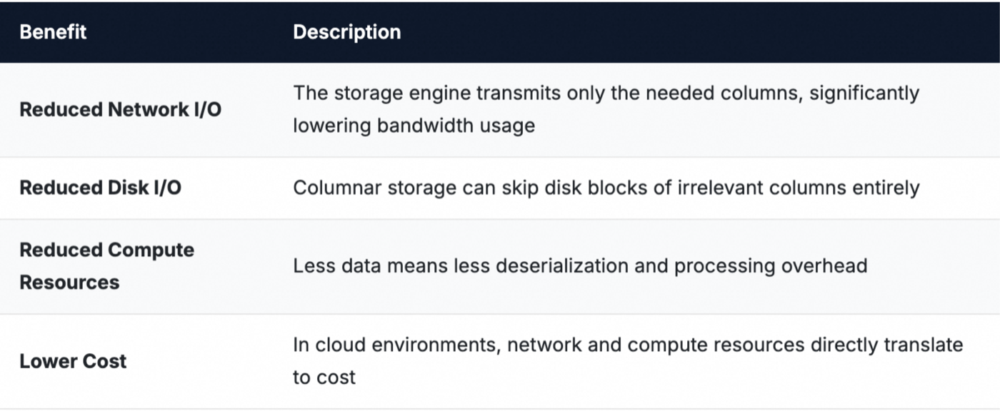

In production, a wide table may have hundreds of columns, while a downstream query typically uses only 5–10. In such cases, column pruning can reduce data transfer by an order of magnitude.

## Why Can't Apache Kafka Do Column Pruning?

### The Kafka Broker Has No Schema Awareness

Apache Kafka's broker treats records as opaque byte arrays and has no understanding of the data structure within. Schema parsing relies on client-specified formats such as JSON or Avro. This means that even if a consumer tells the broker "I only need columns `a` and `b`," the broker cannot understand or act on that request.

### Kafka Uses Row-Based Storage

Kafka stores each message as a contiguous byte sequence containing all fields. Because all fields are packed together, there is no way to skip a subset of columns during a fetch. The entire message must be read and transferred.

### "Pseudo-Pruning": Pruning Happens on the Client, Not the Server

The current Flink and Kafka column pruning implementation runs entirely at the Flink Source (client side). The Kafka broker still sends the full record to the consumer, which then discards irrelevant columns through field mapping during deserialization.

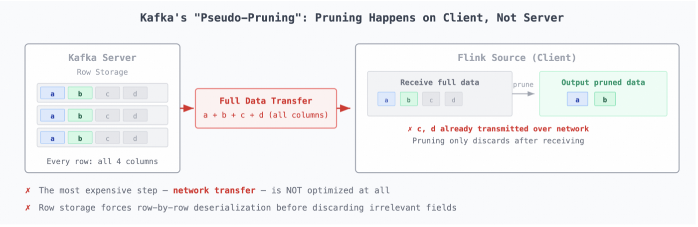
*Figure 1: Kafka's "Pseudo-Pruning" -- pruning happens on the client side, not saving any network I/O*

As shown above, the entire pruning process can be summarized as: the Kafka broker sends full records to the Flink Source, which prunes fields row by row during deserialization, then emits the pruned output.

The most expensive step, the network transfer from broker to consumer, is not optimized at all. All columns are still transmitted over the network; pruning merely filters them out at the destination.

:::note Summary
Kafka's column pruning is pseudo-pruning. It operates on the client side and saves no broker-to-client network I/O, which is typically the dominant cost. Combined with the row-oriented storage model, even client-side pruning requires parsing every record in full before discarding irrelevant fields, making it highly inefficient for wide-table workloads.
:::

## Core Challenges of Column Pruning in Streaming Storage

Introducing column pruning into streaming storage is fundamentally different from doing so in traditional OLAP or data lake systems. OLAP systems process bounded data and can perform extensive sorting and encoding optimizations after writes are complete. Streaming storage, by contrast, faces continuous-append and real-time consumption workloads with strict latency and throughput requirements. This creates three distinct challenges.

### Challenge 1: Column Pruning vs. Streaming Writes, a Fundamental Storage Layout Conflict

Efficient column pruning requires columnar storage, where data for each column is stored contiguously so that irrelevant columns can be skipped entirely during reads. But streaming storage systems are inherently row-append-based: data arrives record by record, each containing all fields, and must be persisted promptly. This creates a fundamental contradiction: **data arrives in rows but must ideally be stored in columns**.

During Fluss's evolution, we explored a compromise: the **Indexed Row** format. It is a row-based format with field-offset indexes in each record's header, allowing direct jumps to target fields without parsing the entire record. The results were disappointing. Indexed Row is still fundamentally row storage: all fields within each record are packed together, so reads still require row-by-row scanning. Its performance gains in column pruning scenarios were minimal, and this approach was ultimately a dead end.

The real solution is to adopt a true columnar storage format. The most widely adopted columnar file format in batch analytics is Parquet. However, Parquet is designed entirely for offline batch processing and poses a fundamental problem for streaming reads. Parquet requires all row groups to be written before the file footer (which contains the column offset index) can be emitted, meaning a Parquet file can only be consumed after it is completely closed. This makes sub-second streaming latency impossible.

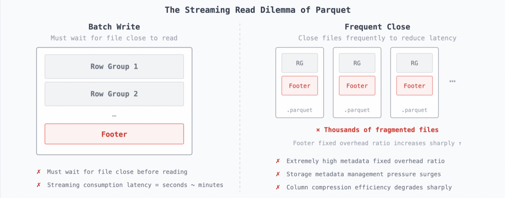
*Figure 2: The Streaming Read Dilemma of Parquet -- batch write vs. frequent close*

This is the first fundamental challenge of column pruning in streaming storage: **existing columnar formats are designed for batch processing and cannot simultaneously satisfy low-latency streaming consumption and efficient columnar storage**.

### Challenge 2: Eliminating Server-Side Pruning Overhead

How can the server perform column pruning without incurring additional computation and memory overhead?

The traditional approach is a full deserialize-prune-reserialize cycle on the server: upon receiving a read request, the server deserializes all data from disk into memory, performs column pruning in memory, then reserializes and sends the pruned data to the consumer. This is feasible for low-frequency query systems, but a streaming storage server is a shared resource serving many concurrent consumers. Each read request that triggers a full decode-prune-encode cycle adds 2–5x memory amplification under load.

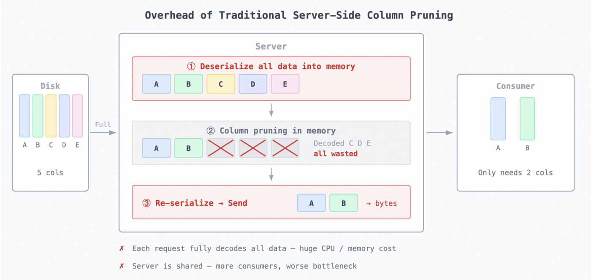
*Figure 3: Overhead of Traditional Server-Side Column Pruning -- deserialize, prune, re-serialize*

This is the second core challenge: **a streaming storage server needs a zero-overhead column pruning approach: no data parsing, no extra memory allocation, just metadata and byte-offset manipulation**.

### Challenge 3: The Tension Between Low-Latency Writes and Columnar Batching

Columnar storage efficiency depends heavily on batch size. Larger batches mean more contiguous data per column, better compression ratios, and more efficient bulk reads. But streaming storage has strict write latency requirements (typically sub-100 ms), making indefinite batching impractical.

The problem is compounded by data distribution. In a typical Flink write scenario, multiple Sink operator instances distribute records across all Buckets via round-robin. With N Sink instances and M Buckets, this creates N×M connections, each carrying a small fraction of the total data.

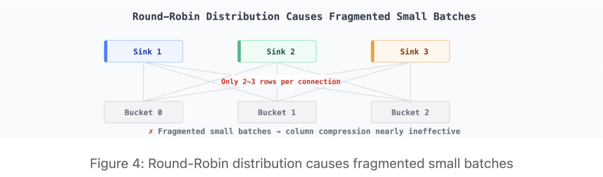
*Figure 4: Round-Robin distribution causes fragmented small batches*

Such fragmented small batches are devastating for columnar storage: too few rows per column render compression algorithms nearly useless, column contiguity is lost, and storage efficiency can degrade below even row storage. This is the third core challenge: **the fundamental tension between streaming storage's low-latency write requirements and columnar storage's dependence on large batches, further amplified by round-robin data distribution**.

## How Does Fluss Implement Column Pruning?

With the above challenges understood, let's see how Apache Fluss addresses them. Column pruning is designed as a core feature from the ground up, with end-to-end solutions spanning the storage format, the server-side read path, and the client-side write pipeline. Compared to Kafka's pseudo-pruning, Fluss achieves three key breakthroughs:

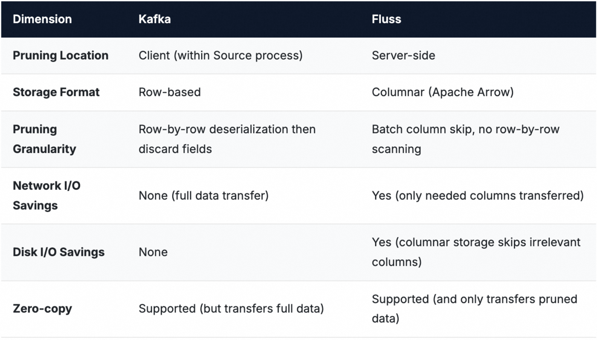

### Key Design 1: Streaming Columnar Storage Format with Apache Arrow

Challenge 1 surfaced two requirements: the storage format must be columnar (unlike Kafka's row storage), and column metadata must be inlined with each batch (unlike Parquet's file-level footer). Fluss chose the **Apache Arrow IPC Streaming Format** as the on-disk format for log segments, satisfying both requirements simultaneously.

A Fluss Log Segment consists of sequentially appended RecordBatches, each ranging from 100 KB to several MB. Each RecordBatch has two parts:

- **Fluss Header:** contains `magic`, `schemaId`, `batchLen`, `rowCount`, and other fields for quick location and validation.
- **Arrow RecordBatch:** follows the standard Arrow IPC format, with a leading metadata section (FlatBuffers-encoded, recording each column's byte offset, length, and FieldNode) followed by contiguous column Buffer data.

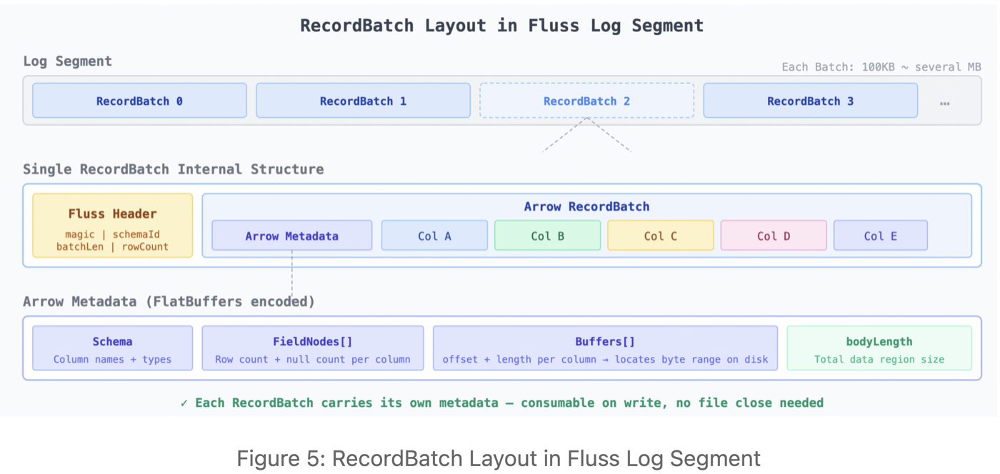
*Figure 5: RecordBatch Layout in Fluss Log Segment*

This design addresses both challenges directly. Because data for the same column is stored contiguously within each RecordBatch, reading a specific column can skip all other columns' disk regions entirely, with no row-by-row scanning. And because each RecordBatch carries its own complete Arrow metadata, it can be consumed independently as soon as it is written, with no need to wait for file closure. Streaming consumers can read batch by batch with millisecond-level latency.

### Key Design 2: End-to-End Zero-Copy Column Pruning

Fluss leverages Arrow's buffer layout to achieve true end-to-end zero-copy column pruning: target column data travels from disk to the network without ever entering user space.

When the server receives a column-pruning read request, the processing flow is:

1. **Read Arrow metadata:** The RecordBatch header records each column's byte offset and length within the file.
2. **Reconstruct the buffer descriptor:** Build new metadata referencing only the target columns' FieldNodes and Buffers, without reading any column data from disk.
3. **Send directly to the network:** Transfer the new metadata and the target columns' raw byte ranges from the page cache to the network interface card (NIC), bypassing user space entirely.

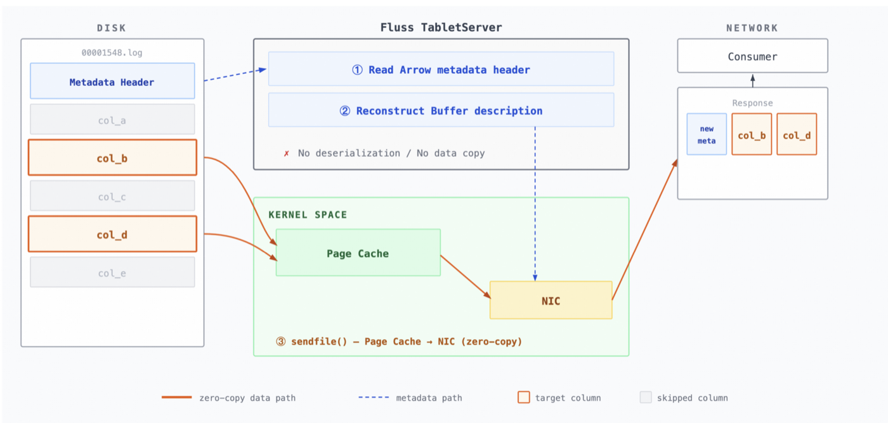
*Figure 6: Fluss Zero-Copy Column Pruning -- from disk to NIC without user-space data parsing*

Throughout this process, the server neither deserializes nor reserializes any data. It reassembles buffer references based on Arrow metadata and transfers the target columns' bytes directly to the network. This is the fundamental reason Fluss's column pruning performance scales linearly with the pruning ratio.

### Key Design 3: Client-Side Pre-Shuffle for Large Batches

To address the batching dilemma from Challenge 3, Fluss performs a pre-shuffle (client-side data partitioning) that consolidates records destined for the same bucket before they are sent to the server, transforming fragmented small batches into large contiguous ones. Fluss implements three strategies for this:

**Sticky Bucket Assigner:** For data without an explicit Bucket Key, Sinks can freely choose which Bucket to write to. The Sticky Bucket Assigner keeps writing to one Bucket until the batch is full (default: 2 MB), then switches to the next Bucket. This maximizes the number of rows per batch before any Bucket transitions.

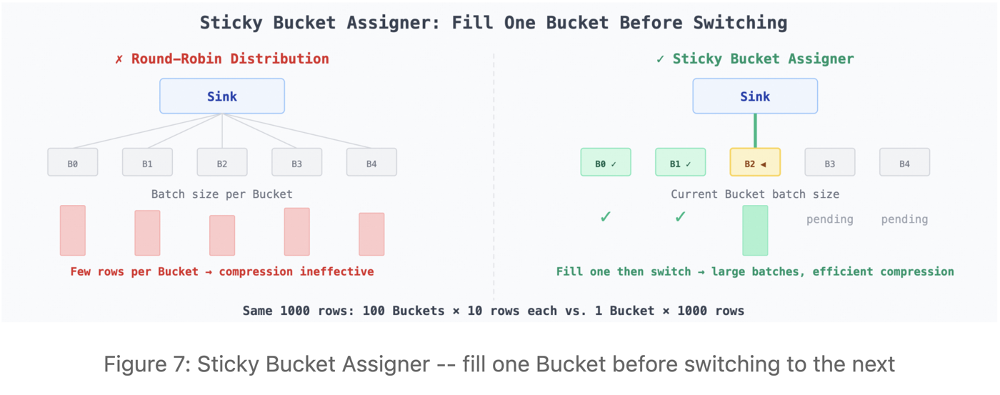
*Figure 7: Sticky Bucket Assigner -- fill one Bucket before switching to the next*

**Dynamic Shuffle Sink:** For partitioned tables with many partitions (e.g., hundreds), the write-side buffer is spread thinly across all partitions, causing each partition's batch to hold as little as a single row. Dynamic Shuffle Sink analyzes partition traffic at runtime and allocates Sink parallelism proportionally, so each Sink instance writes to as few partitions as possible, maximizing per-partition batch size.

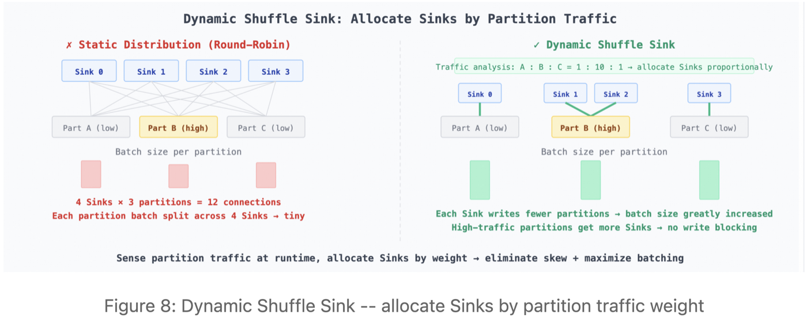
*Figure 8: Dynamic Shuffle Sink -- allocate Sinks by partition traffic weight*

**Bucket Shuffle:** When a table defines a Bucket Key, each record must be routed to its corresponding Bucket, forcing Sinks to fan out to all Buckets simultaneously. Bucket Shuffle performs the partitioning on the Flink side using the Bucket Key, concentrating data for the same Bucket at a single Sink operator instance before it reaches Fluss, eliminating the fan-out fragmentation.

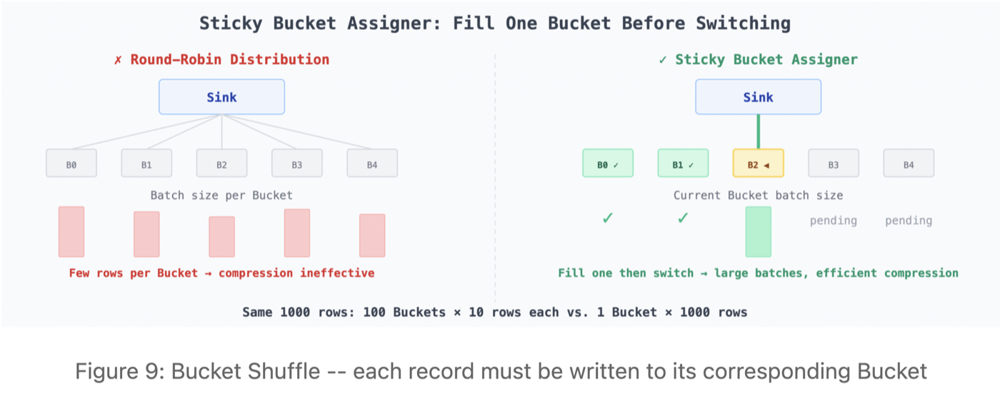
*Figure 9: Bucket Shuffle -- each record must be written to its corresponding Bucket*

Together, these strategies ensure that within the target write latency (default: 100 ms), each batch contains enough rows that same-column data is stored contiguously on disk and can be fetched in efficient bulk reads.

### Putting It All Together

Fluss's column pruning is not a single-point optimization but an end-to-end solution spanning the on-disk storage format, the server-side read path, and the client-side write pipeline.

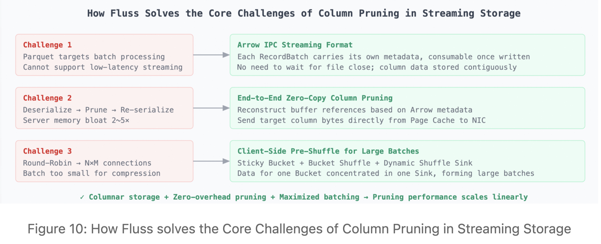
*Figure 10: How Fluss solves the Core Challenges of Column Pruning in Streaming Storage*

Because each layer addresses exactly its corresponding challenge, column pruning performance scales linearly with the pruning ratio. Pruning 50% of columns yields approximately 2x read throughput improvement; pruning 90% of columns yields approximately 10x.

## Performance

Read throughput improves linearly with the column pruning ratio. When 90% of columns are pruned, read throughput increases by 10x. Because pruning happens server-side, the pruned columns are never read from disk and never transmitted over the network, so the throughput gain is roughly proportional to the pruning ratio. Kafka's throughput, by contrast, remains constant regardless of how many columns the consumer requests.

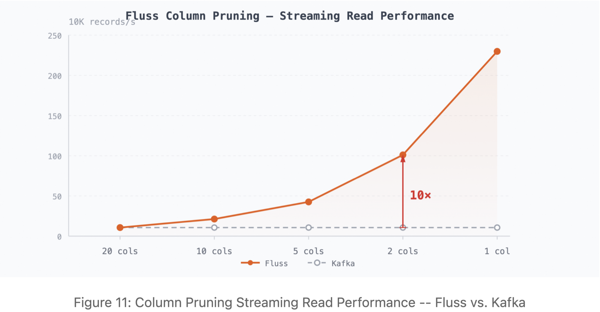
*Figure 11: Column Pruning Streaming Read Performance -- Fluss vs. Kafka*

### Test Setup

The benchmark uses the [Open Message Benchmark (OMB)](https://github.com/openmessaging/benchmark) dataset, which is widely used in the messaging systems community. The schema has 20 columns covering Integer, Long, and String types, representing a typical wide-table read scenario. Each record is 2 KB. For the test, 100 GB of data was pre-loaded onto the server with writes stopped, and remote tiering was disabled, so all reads are served entirely from the TabletServer's local disk.

### Results

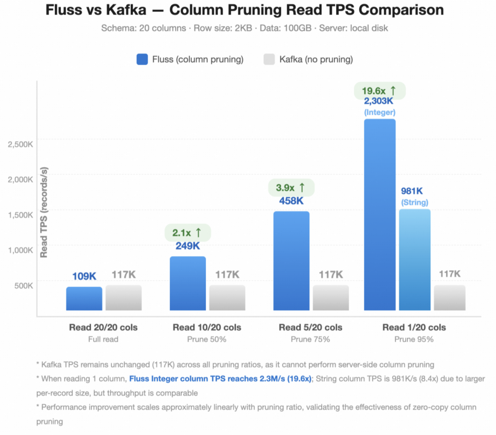
*Figure 12: Fluss vs. Kafka -- Column Pruning Read TPS Comparison*

Kafka's throughput remains flat at 117K records/s across all pruning ratios because the broker performs no server-side column pruning. Fluss's throughput improves approximately linearly with the pruning ratio, confirming the effectiveness of zero-copy server-side pruning.

## References

- [Apache Fluss](https://github.com/apache/fluss)
- [Apache Arrow IPC Streaming Format](https://arrow.apache.org/docs/format/IPC.html)
- [Sticky Bucket Assigner (Source Code)](https://github.com/apache/fluss)
- [Dynamic Shuffle Sink for Partitioned Tables](https://github.com/apache/fluss)
- [Bucket Shuffle PR](https://github.com/apache/fluss)
- [Open Message Benchmark (OMB)](https://github.com/openmessaging/benchmark)

---

If you found this interesting, consider exploring the [Apache Fluss documentation](https://fluss.apache.org) or giving the project a star on [GitHub](https://github.com/apache/fluss). Community contributions, feedback, and bug reports are always welcome.
