Every autumn in China, social media floods with posts about "The First Cup of Milk Tea in Autumn." With a tap on their phone, consumers expect their order delivered within 30 minutes. That effortless experience is no accident: it is the result of Taobao Instant Commerce making thousands of data-driven decisions every second.

Taobao Instant Commerce has scaled from a single-category food delivery service into a high-frequency platform spanning fresh produce, consumer electronics (3C), and beauty products. It operates under two very different modes: steady high-frequency daily transactions, and explosive traffic surges during promotional events where order volumes can multiply within minutes. Both demand the same thing: real-time responsiveness across hundreds of millions of SKUs.

**Real-time** is not a nice-to-have here; it is the lifeline for three critical functions:
* **Operations:** Refresh conversion rates and funnels within 30 seconds.
* **Algorithms:** Order prediction models must iterate at minute-level granularity.
* **Quality Assurance:** Canary release anomalies must be detected within seconds and trigger instant alerts.

The existing pipeline (built on Kafka, Flink, Paimon, and StarRocks) handled this at one scale. But as the business grew, three fundamental bottlenecks emerged: unbounded state growth from stream joins, mounting complexity in building multi-stream denormalized tables, and excessive resource consumption from lakehouse synchronization. Together they formed an **impossible triangle**: no matter how the team tuned the system, latency, consistency, and cost could not all be optimized at once.

Fluss broke this impasse. By replacing the fragmented stream-batch architecture with a unified storage layer, its features (Delta Join, Partial Update, Streaming-Lakehouse Unification, Column Pruning, and Auto-Increment Columns) systematically eliminated all three bottlenecks and fundamentally reshaped how Taobao Instant Commerce handles real-time decision-making at scale.

<!-- truncate -->

## The "Impossible Triangle" Dilemma: Business Pain Points & Technical Challenges

The real-time data system of Taobao Instant Commerce must reliably process ultra-large-scale, high-concurrency data streams.
It must also build real-time denormalized tables (wide tables) that aggregate metrics across multiple business domains, and support core pipelines such as associating page view streams with order streams, as well as canary release monitoring.
This imposes extreme requirements on latency, consistency, cost-efficiency, and system scalability.

Under the traditional technology stack, challenges across these four dimensions were deeply intertwined, ultimately forming the same trilemma of latency, consistency, and cost that the business had already identified.

The root cause lies in the stream-batch separation at the storage layer: Kafka serving as the message queue, represents the "stream" abstraction, while Paimon, as the lakehouse format, represents the "batch" abstraction. 
Bridging these two relies heavily on numerous Flink ETL jobs acting as a **glue layer.**
Each additional layer of glue compounds latency, increases costs, and heightens the risk to data consistency.

### Four Core Business Issues
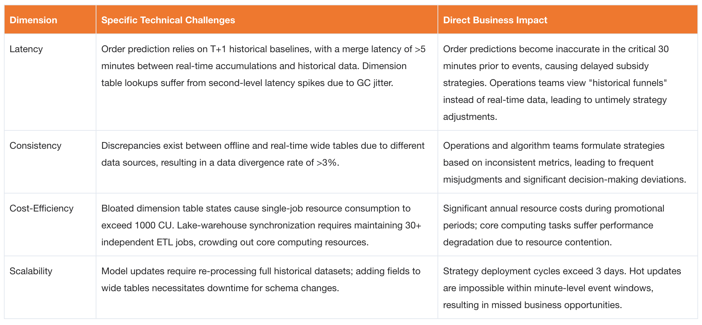

### Three Core Pain Points of the Traditional Tech Stack
The traditional pipeline based on Kafka, Flink and Paimon exposed three critical pain points under Taobao Instant Commerce’s massive scale, high concurrency, and strict real-time requirements. 
These issues became the core focus areas for the subsequent Fluss implementation: 
* **Surging Memory Pressure from Dual-Stream Joins:** Kafka lacks native support for dimension table lookups. Consequently, order information had to be fully loaded into Flink `State`. During promotional events, over **100 million** orders caused the state size of single jobs to surge to **hundreds of GBs**, leading to `Checkpoint` timeouts and frequent task failures.
* **Fan-Out Pipeline Complexity in Wide Table Construction:** The product-store analysis wide table depended on 5+ upstream systems. Using Kafka required writing to a new Topic after every Join operation, resulting in a sprawling, tightly coupled pipeline with high operational and maintenance costs.
* **Core Resource Drain from Lakehouse Synchronization:** Each table synced to Paimon required maintaining an independent Flink consumption job. During peak events, dozens of these "data transfer" jobs ran simultaneously, competing with core computing tasks for resources and causing overall performance degradation.

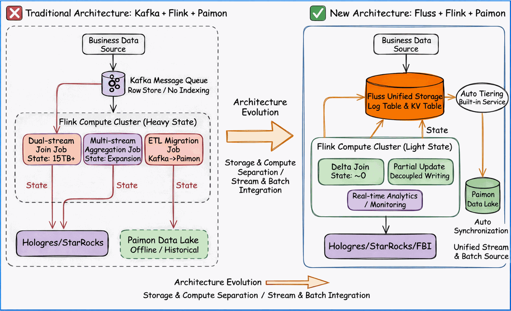

### Architecture Selection Logic: From "Compute-Layer Stitching" to "Storage-Layer Unification"

Guided by the **impossible triangle** dilemma described above, we established a core principle for our technology selection: the breakthrough lies not in the compute layer, but in the storage layer. 
The traditional architecture, relying on the combination of Kafka, Flink and Paimon as the open table format, was essentially a **stitched** model characterized by stream-batch separation.
As the compute engine, Flink was forced to assume numerous **glue** responsibilities: maintaining **TB-scale** `State`, scheduling dozens of data transfer jobs, and handling memory bloat from dual-stream joins. 
This not only drove up resource costs but also made data consistency difficult to guarantee.

Fluss’s design philosophy directly addresses this pain point through Stream-Batch Unification at the storage layer. 
It is not merely another message queue; rather, it converges streaming consumption and batch querying into a single distributed storage kernel. 
Streaming and batch operations require no data replication, no format conversion, and no additional ETL jobs for data movement. 
This fundamental shift in underlying architecture directly eliminates the three primary sources of latency, cost, and consistency risks inherent in traditional pipelines, providing a unified foundation for the implementation of subsequent core features.

## Fluss Core Scenario Implementation
Taobao Instant Commerce designed a three-layer architecture underpinned by five core Fluss capabilities, each mapped to a specific business need. By establishing Fluss as the unified data foundation, this architecture covers the entire pipeline, from data ingestion and stream-batch processing to lakehouse storage and service delivery, eliminating the pain points described above.

### Three-Layer Overall Architecture

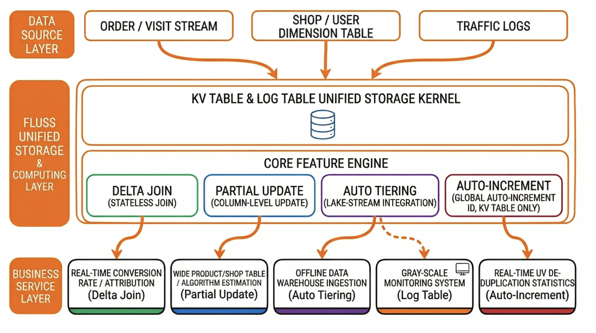
The real-time data system of Taobao Instant Commerce, powered by Fluss, is structured into three layers: the Data Source Layer, the Fluss Storage & Compute Layer, and the Business Service Layer. Built on the core philosophy of Stream-Batch Unification, this architecture enables **Write Once, Read Anywhere** data reuse, completely eliminating the stream-batch separation and glue-layer ETL jobs inherent in traditional pipelines.
* **Data Source Layer:** Integrates all business data sources (including order streams, visit streams, product dimension tables, and inventory/price streams) and uniformly writes them into Fluss’s Log Tables or KV Tables, adapting to the specific ingestion characteristics of each data source.
* **Fluss Storage & Compute Layer:** As the core layer, it achieves unified data storage via Fluss’s Log/KV Tables. It leverages features like Delta Join, Partial Update, and Streaming-Lakehouse Unification (Auto-Tiering) to handle real-time computation, multi-table joins, wide table construction, and lakehouse synchronization. Crucially, it provides stateless computing support for Flink, significantly reducing state management overhead. 
* **Business Service Layer:** Leveraging a unified data view from both Fluss and lakehouse storage (Paimon), this layer delivers data services to operational real-time dashboards, algorithmic order prediction models, canary monitoring systems, and product-store analysis systems, enabling decision support within seconds.

### Five Core Scenarios and Feature Combination Matrix

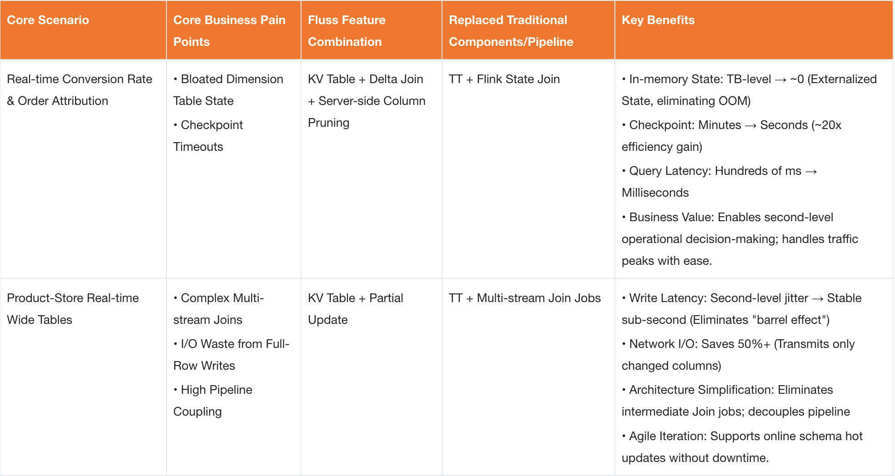
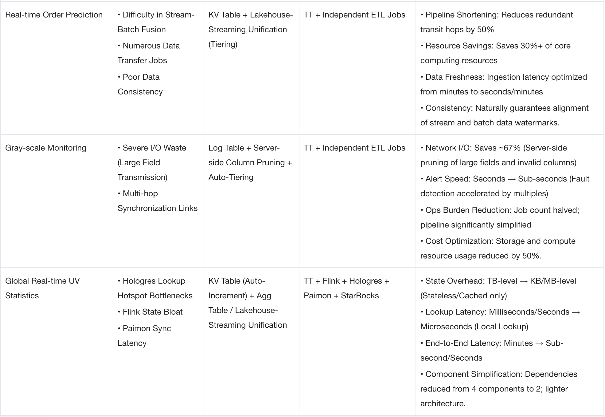

The following sections walk through five production scenarios where Fluss was applied, covering the architectural decisions, implementation details, and measured results for each.

## Scenario 1: Real-Time Conversion Rate and Order Attribution: Solving Unbounded State Growth in Dual-Stream Joins with Delta Join

Conversion Rate (defined as the ratio of purchasing users to visiting users) is a core metric for measuring conversion efficiency in Taobao Instant Commerce. 
Its calculation relies on the real-time join of user visit streams with order streams, directly enabling operational decisions within seconds.

### Pain Points of Traditional Solutions
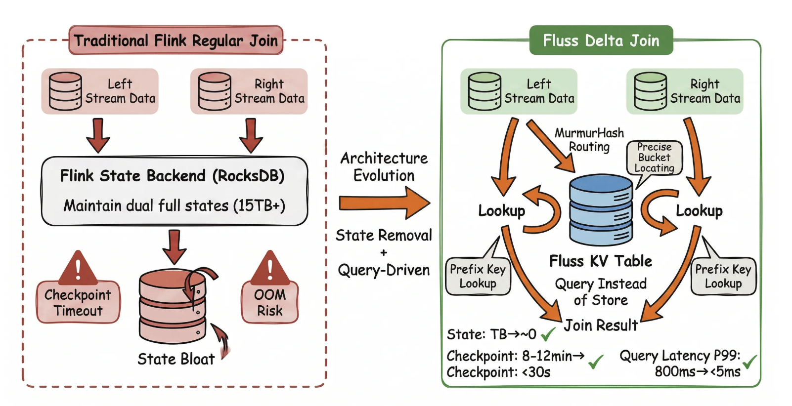
In the legacy architecture, a Flink Regular Join must continuously accumulate all unexpired events in its local state to match orders with browsing records.
This creates an architectural dilemma: extending the conversion observation window incurs linearly growing storage costs.

- **Unbounded State Growth & Compaction Pressure:** During promotional events, hundreds of billions of access logs must be retained within long time windows. The total state for a single job grew past **TB levels**, leading to severe `RocksDB` compaction backlogs and extremely long checkpoint durations.
- **I/O Saturation & Latency Degradation:** Amplified `State` read/write operations saturated disk I/O. Real-time attribution latency degraded from seconds to minutes.
- **Checkpoint Failures & High RTO:** `Checkpoint` durations deteriorated from minutes to **10–15 minutes**, frequently causing timeouts and failures.
- **Limited Attribution Window:** The effective association time window was constrained by local storage capacity, making it impossible to support long-cycle "Browse-to-Order" conversion attribution.

### Architecture Based on Fluss Delta Join

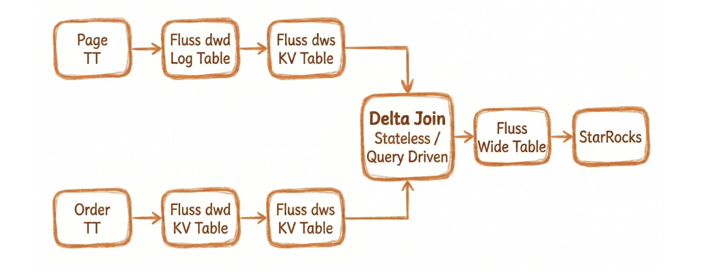
To address the pain points of traditional architectures, our solution upgrades the conventional Flink dual-stream join to a Delta Join. This approach offloads the full volume of dual-stream data from Flink `State` to Fluss KV Tables (backed by `RocksDB`). By implementing bidirectional Prefix Lookup (where incoming records from either stream trigger a lookup in the opposite KV Table), we achieve a near-stateless dual-stream join. Furthermore, query performance is enhanced through `MurmurHash`-based bucket routing and column pruning.
* **Dual KV Table Ingestion with Composite Keys:** The real-time order stream is written to a Fluss KV Table with `PRIMARY KEY (user_id, ds, order_id)` and `bucket.key = ‘user_id’`. Simultaneously, real-time traffic visit logs are written to a Fluss KV Table with `PRIMARY KEY (user_id, ds)` and `bucket.key = ‘user_id’`. Both tables use a composite primary key design where the join key (`user_id`) serves as the `bucket.key` and is a strict prefix of the primary key, enabling efficient Prefix Lookup operations.
* **Stateless Bidirectional Join via Delta Join Operator:** Leveraging the Delta Join operator in Flink 2.1+, we implement bidirectional association: incoming orders trigger lookups in the visit log table, and incoming visits trigger lookups in the order table. Flink calculates the target `bucketId` using `MurmurHash(bucket.key)` to route RPC requests precisely to the single Fluss TabletServer holding that specific bucket’s `RocksDB` instance. This eliminates the need for broadcast scans or full-table scans. The Flink operator itself retains only minimal transient state (for asynchronous lookup queues), completely removing dependency on large-scale Join `State`.
* **Real-Time Attribution & Lakehouse Sync:** The joined results are written to a Fluss wide table and automatically synchronized to Paimon via the Streaming-Lakehouse Unification mechanism. The data is finally served to StarRocks and real-time BI dashboards, achieving metric refresh latency within 30 seconds.

### Core DDL and Join SQL

```sql
-- Note: ${xxx} represents environment-specific parameters. 
-- Actual deployment values should be evaluated based on cluster scale and data volume.

-- Order Stream (Right Table in Join)
CREATE TABLE `fluss_catalog`.`db`.`order_ri` (
    order_id STRING,
    user_id STRING,
    order_time STRING,
    pay_amt STRING,
    ds STRING,
    PRIMARY KEY (user_id, ds, order_id) NOT ENFORCED
) PARTITIONED BY (ds)
WITH (
    'bucket.key' = 'user_id',
    'bucket.num' = '${BUCKET_NUM}',
    'table.auto-partition.enabled' = 'true',
    'table.auto-partition.key' = 'ds'
);

-- Visit Stream (Left Table in Join)
CREATE TABLE `fluss_catalog`.`db`.`log_page_ri` (
    user_id STRING,
    first_page_time STRING,
    pv BIGINT,
    ds STRING,
    PRIMARY KEY (user_id, ds) NOT ENFORCED
) PARTITIONED BY (ds)
WITH (
    'bucket.key' = 'user_id',
    'bucket.num' = '${BUCKET_NUM}',
    'table.auto-partition.enabled' = 'true',
    'table.auto-partition.key' = 'ds'
);

-- Sink Table
CREATE TABLE `fluss_catalog`.`db`.`log_page_ord_detail_ri`
(
    `user_id`       STRING COMMENT 'User ID',
    `order_id`      STRING COMMENT 'Order ID',
    `first_page_time` STRING COMMENT 'First Visit Time',
    `order_time`    STRING COMMENT 'Order Placement Time',
    `pv`            BIGINT COMMENT 'Page Views (Visit Count)',
    `pay_amt`       STRING COMMENT 'Payment Amount',
    `is_matched`    STRING COMMENT 'Match Status',
    `ds`            STRING COMMENT 'Date Partition',
   PRIMARY KEY (user_id, order_id, ds) NOT ENFORCED
)
COMMENT 'Attribution Result Table'
PARTITIONED BY (ds)
WITH (
    'bucket.key' = 'user_id,order_id',
    'bucket.num' = '${BUCKET_NUM}',
    'table.auto-partition.enabled' = 'true',
    'table.auto-partition.key' = 'ds',
    'table.datalake.enabled' = 'true', -- Enable Streaming-Lakehouse Unification
    'table.datalake.freshness' = '3min' -- Controls Lakehouse Table Freshness
);
```
Subsequently, the Lakehouse Tiering Service continuously syncs data from Fluss to Paimon.
The `table.datalake.freshness` parameter controls how frequently Fluss writes data to the Paimon table.
By default, the data freshness is set to **3 minutes**.

The implementation of the Delta Join is as follows:

```sql
CREATE TEMPORARY VIEW matched_page_ord_detail AS
SELECT
    l.ds,
    l.user_id,
    l.first_page_time,
    l.pv,
    o.order_id,
    o.order_time,
    CASE WHEN o.order_time >= l.first_page_time THEN '1' ELSE '0' END AS is_matched
FROM `fluss_catalog`.`db`.`log_page_ri` l
    LEFT JOIN `fluss_catalog`.`db`.`order_ri` o
        ON l.user_id = o.user_id AND l.ds = o.ds
```

Fluss supports two TTL (Time-To-Live) mechanisms:
* **Changelog Expiration:** Controlled by `table.log.ttl` (default: 7 days).
* **Data Partition Expiration:** Controlled by `table.auto-partition.num-retention` (default: 7 partitions).

### Measured Results
The Fluss Delta Join solution enables stateless dimension table joins, completely eliminating the unbounded state growth problem and delivering order-of-magnitude improvements in core metrics:

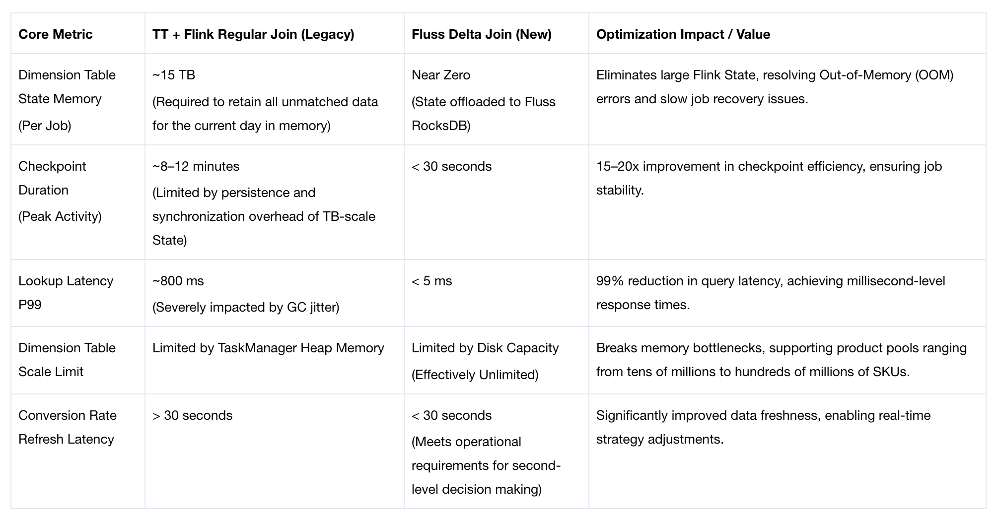

## Scenario 2: Real-Time Product-Store Wide Table: Efficient Column-Level Updates via Partial Update

In Taobao Instant Commerce’s traffic operations ecosystem, the Real-time Product-Store Wide Table (a denormalized table that combines metrics from multiple behavioral data sources into a single queryable record) is the most critical data asset in the traffic domain.
This table must aggregate four core behavioral streams (impressions, clicks, visits, and orders) in real time, producing key metrics across both "Product" and "Store" dimensions. These include UV/PV counts for each event type (where UV = unique users and PV = total event count), unique orders, and GMV. The table directly powers real-time traffic dashboards, ROI analysis, algorithmic feature engineering, and decision-making during live promotional events.

However, under extreme scale and concurrency, traditional real-time aggregation models based on multi-stream joins face severe challenges: excessive state accumulation, high pipeline coupling, and poor fault tolerance.

Fluss addresses these issues by leveraging Partial Update. It refactors the complex **multi-stream real-time join aggregation** model into a streamlined architecture of **independent multi-stream writes with automatic server-side column-level merging**. This transformation simplifies the real-time wide table construction pipeline and delivers a leap in performance.

### Pain Points of Traditional Solutions
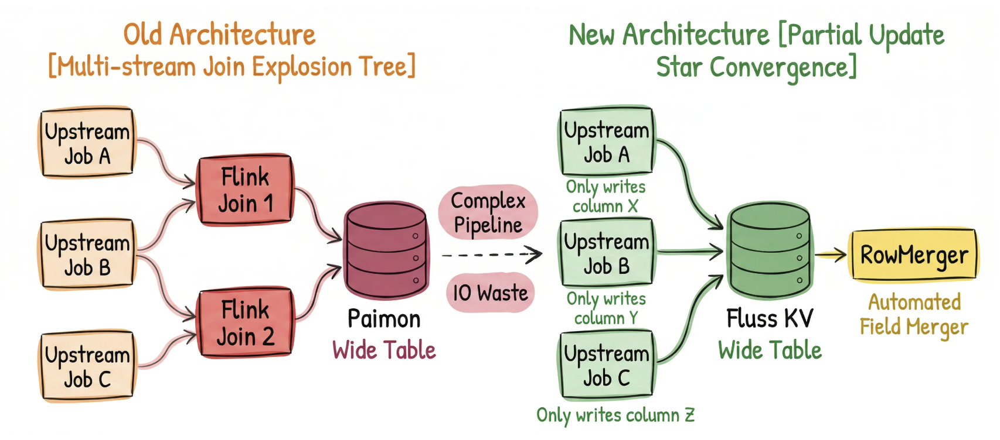

The legacy solution constructed the wide table using multi-stream Flink joins over Kafka topics, resulting in a tightly coupled fan-in architecture. Its core pain points were as follows:
* **Full-Row Write I/O Waste:** Even if only a single behavior metric (e.g., "clicks" or "impressions") is updated, the system must write all 100+ columns of the full row. This causes severe redundancy in both network and storage I/O. 
* **High Operational Complexity:** The architecture resembles a fan-out pipeline, requiring N upstream jobs and M join jobs to be maintained in parallel. Adding a new field requires modifying multiple jobs, significantly increasing operational overhead. 
* **Latency Coupling (Straggler Problem):** The write latency of the wide table is determined by the slowest upstream stream. A delay in any single data stream causes the entire row update to be delayed, leading to inconsistent real-time visibility. 
* **Unbounded State Growth and No Live Schema Updates:** To match data across different behavioral streams for conversion rate calculations, Flink must cache large amounts of intermediate state locally. This leads to **TB-scale** unbounded state growth, `Checkpoint` timeouts, and risk of out-of-memory (OOM) errors. Furthermore, the tightly coupled join logic means the system cannot be updated while running: any schema change, scaling operation, or model update requires a full service restart and data reprocessing.

### Architecture Based on Fluss Partial Update
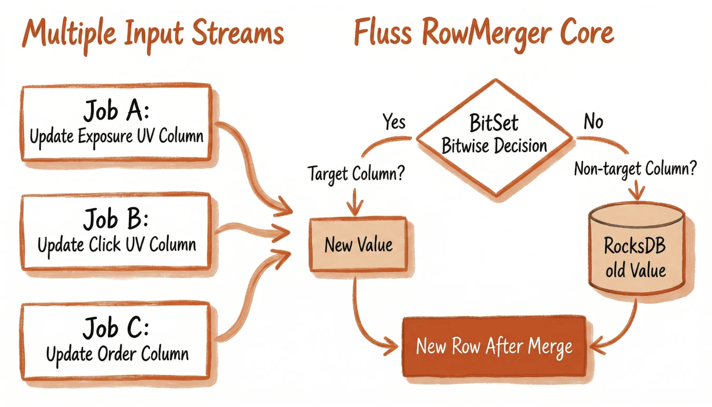

To address the aforementioned pain points, our solution utilizes Fluss KV Tables as the unified storage for a multi-dimensional wide table (spanning Product and Store dimensions). By leveraging Partial Update, we achieve column-level updates that completely decouple the ingestion of diverse behavior streams such as impressions, clicks, visits, and orders. Each Flink job is responsible solely for aggregating its specific behavioral metrics and writing to the target columns, eliminating the need for complex multi-stream joins. The field-level merging is automatically handled by the `RowMerger` on the Fluss server side. The core architectural workflow is as follows:
* **Independent Aggregation & Ingestion of Multiple Streams:** Five or more upstream behavior streams (impressions, clicks, visits, add-to-cart, orders) run as independent Flink jobs. Each job consumes only a single type of behavior log, pre-aggregates data by "Product" or "Store" dimension, and writes exclusively to the corresponding metric columns in the wide table. This approach thoroughly eliminates inter-stream dependencies.
* **Server-Side Intelligent Column-Level Merging:** Fluss leverages the Partial Update feature, utilizing `BitSet` bitmap technology to identify target columns in write requests. Within the storage engine, only the target columns are read and updated (via accumulation or overwrite), while non-target columns retain their historical values in `RocksDB`. This avoids transmitting redundant data over the network or in memory, achieving microsecond-level merging.
* **Streaming-Lakehouse Unification with Auto-Tiering:** The merged, up-to-date wide table data provides low-latency point queries and streaming consumption capabilities in real-time. Simultaneously, the Auto-Tiering mechanism asynchronously syncs data to the Paimon lakehouse. This supports offline T+1 (next-day batch) validation, historical backtracking, and AI model training without requiring additional ETL development for data movement.
* **Online Schema Evolution:** When new statistical metrics are required, business teams simply execute an `ALTER TABLE ADD COLUMN` DDL statement and deploy a new write job for that specific column. This takes effect immediately without downtime or restarting existing jobs (e.g., for impressions or orders), enabling agile iteration even during peak promotional events.

### Core DDL and Per-Job Write Implementation

```sql
CREATE TABLE shop_stat_wide (
                                shop_id      BIGINT NOT NULL,
                                stat_date    STRING NOT NULL,
                                stat_hour    STRING NOT NULL,
                                exp_cnt      BIGINT,   -- Exposure Count
                                page_cnt     BIGINT,   -- Page View Count
                                PRIMARY KEY (shop_id, stat_date, stat_hour) NOT ENFORCED
) WITH (
      'bucket.num' = '${BUCKET_NUM}',
      'bucket.key' = 'shop_id'
      );

-- Write Exposure Data
INSERT INTO shop_stat_wide (shop_id, stat_date, stat_hour, exp_cnt)
SELECT
    shop_id,
    stat_date,
    stat_hour,
    SUM(exp_cnt) AS exp_cnt
FROM exposure_log
GROUP BY shop_id, stat_date, stat_hour;

-- Write Visit Data
INSERT INTO shop_stat_wide (shop_id, stat_date, stat_hour, page_cnt)
SELECT
    shop_id,
    stat_date,
    stat_hour,
    SUM(page_cnt) AS page_cnt
FROM page_log
GROUP BY shop_id, stat_date, stat_hour;
```

### Measured Results
The Fluss Partial Update solution enables column-level updates and decoupled writes for wide tables, delivering significant improvements in core metrics while reducing operational costs.

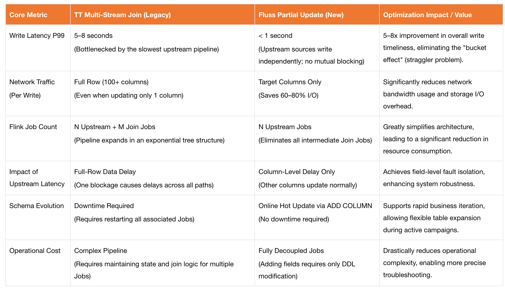

## Scenario 3: Real-Time Order Estimation: Efficient Data Fusion via Fluss KV Lake-Stream Unification
Real-time order forecasting serves as a critical support pillar in Taobao Instant Commerce’s algorithmic decision-making framework. 
During promotional events, the system iterates the prediction model every minute to accurately project the total daily Gross Merchandise Volume (GMV), thereby enabling dynamic adjustments to subsidy strategies and inventory allocation.
This scenario imposes extreme challenges on the data pipeline: model inputs must deeply integrate real-time cumulative order streams (high-frequency incremental data) with historical baseline data from corresponding periods (massive static data), demanding exceptionally high standards for both data consistency and low latency.

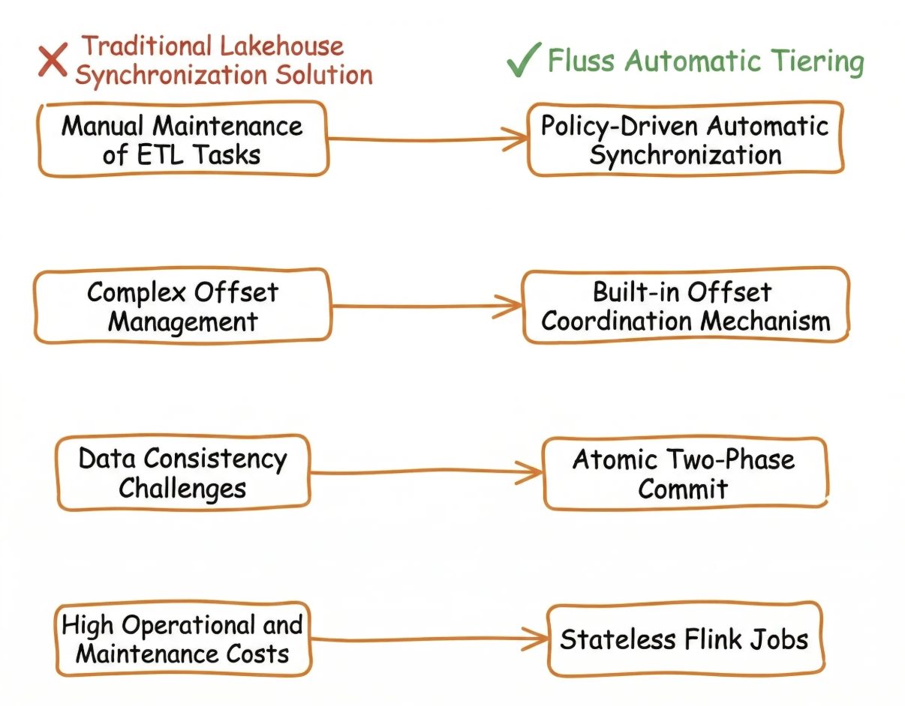

### Architecture Based on Fluss Lake-Stream Unification
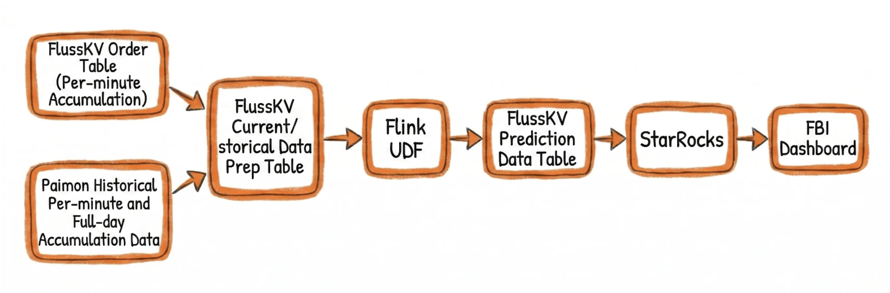

The current implementation leverages Fluss KV Tables as a unified storage layer for both streaming and batch processing. By integrating Streaming-Lakehouse Unification, it enables automated synchronization to the data lake. Since both streaming and batch operations rely on the same KV Table, data consistency is inherently guaranteed. This approach eliminates the need for independent data migration jobs, ensuring low-latency synchronization of prediction results.

Core Architecture Workflow:
* **Real-time Accumulation:** The real-time order stream is written into the Fluss KV Table, enabling the calculation of rolling cumulative order counts on a per-minute basis via stream reads. 
* **Efficient Stream-Batch Fusion:** A Flink UDF directly reads both real-time data (via stream read) and historical baseline data (via batch read / Snapshot Lookup) from the Fluss KV Table, achieving efficient fusion of streaming and batch data. 
* **Low-Latency Lake Sync:** Model prediction results are written back to the Fluss KV Table. With automatic Tiering enabled, these results are synchronized to Paimon with low latency (with configurable snapshot intervals). 
* **Unified Data Consistency:** Downstream algorithm models and operational dashboards read real-time prediction results from the Fluss KV Table and historical prediction results from Paimon, ensuring end-to-end data consistency across the entire pipeline.

### Core DDL and Write Implementation

```sql
-- Note: ${xxx} represents environment-specific parameters. 
-- Actual deployment values should be evaluated based on cluster scale and data volume.

-- 1. Real-time Order Minute-Accumulation Stream
CREATE TABLE `fluss_catalog`.`db`.`order_dtm`
(
    `ds` STRING COMMENT 'Day Partition',
    `mm` STRING COMMENT 'Minute',
    `order_source` STRING COMMENT 'Order Source',
    `order_cnt` BIGINT COMMENT 'Order Count',
    PRIMARY KEY (ds, mm, order_source) NOT ENFORCED
)
    COMMENT 'Real-time Order Minute-Accumulation Stream'
PARTITIONED BY (ds)
WITH (
  'bucket.key' = 'mm,order_source',
  'bucket.num' = '${BUCKET_NUM}',
  'table.auto-partition.enabled' = 'true',
  'table.auto-partition.time-unit' = 'day',
  'table.auto-partition.key' = 'ds',
  'table.auto-partition.num-precreate' = '0', -- Number of future partitions to pre-create.
  'table.auto-partition.num-retention' = '2', -- Retain the last N partitions; automatically delete older ones.
  'table.replication.factor' = '${REPLICATION_FACTOR}',
  'table.log.arrow.compression.type' = 'zstd'
);

-- 2. Order Forecast Stream (Fluss Streaming-Lakehouse Unification)
CREATE TABLE `fluss_catalog`.`db`.`order_forecast_mm`
(
    `ds` STRING COMMENT 'Date Partition (Format: yyyymmdd)',
    `mm` STRING COMMENT 'Minute (Format: HH:mm or HHmm)',
    `order_source` STRING COMMENT 'Order Source',
    `cumulative_order_cnt` BIGINT COMMENT 'Cumulative Order Count up to the current minute',
    `forecast_daily_order_cnt` STRING COMMENT 'Predicted Total Daily Order Volume (24h) based on historical ratios',
    PRIMARY KEY (ds, mm, order_source) NOT ENFORCED
)
    COMMENT 'Order Forecast Stream'
PARTITIONED BY (ds)
WITH (
  'bucket.key' = 'mm,order_source',
  'bucket.num' = '${BUCKET_NUM}',
  'table.auto-partition.enabled' = 'true',
  'table.auto-partition.time-unit' = 'day',
  'table.auto-partition.key' = 'ds',
  'table.auto-partition.num-precreate' = '0',
  'table.auto-partition.num-retention' = '2',
  'table.replication.factor' = '${REPLICATION_FACTOR}',
  'table.log.arrow.compression.type' = 'zstd',
  'table.datalake.enabled' = 'true', -- Enable Streaming-Lakehouse Unification
  'table.datalake.freshness' = '30s' -- Controls Lakehouse Table Freshness
);

-- 3. Real-time Incremental & Offline Feature Fusion: 
-- Uses Flink Temporal Join to associate the Fluss real-time stream with the Paimon historical baseline table, 
-- and performs prediction calculations via a UDF.
CREATE TEMPORARY FUNCTION predict_hour_gmv AS 'com.example.flink.udf.FutureHourlyForecastUDF';

CREATE TEMPORARY VIEW trd_item_order AS
SELECT
    ds,
    mm,
    order_source,
    order_cnt,
    PROCTIME() AS proc_time
FROM `fluss_catalog`.`db`.`order_dtm`;

INSERT INTO `fluss_catalog`.`db`.`order_forecast_mm`
SELECT
    t1.ds,
    t1.mm,
    t1.order_source,
    t1.order_cnt AS cumulative_order_cnt,
    predict_hour_gmv(
            COALESCE(t1.order_cnt, 0),
            t1.mm,
            t2.minute_ratio_feat
    ) AS forecast_hour_order_cnt
FROM
    trd_item_order t1
        LEFT JOIN paimon_catalog.db.order_mm_his_str /*+ OPTIONS(
    'scan.partitions' = 'max_pt()',
    'lookup.dynamic-partition.refresh-interval' = '1 h'
) */
FOR SYSTEM_TIME AS OF t1.proc_time AS t2 ON t1.order_source = t2.channel_id;
```

### Measured Results
The Fluss KV Streaming-Lakehouse Unification solution achieves unified source integration for streaming and batch data, eliminating independent data migration jobs and delivering significant improvements in core metrics:

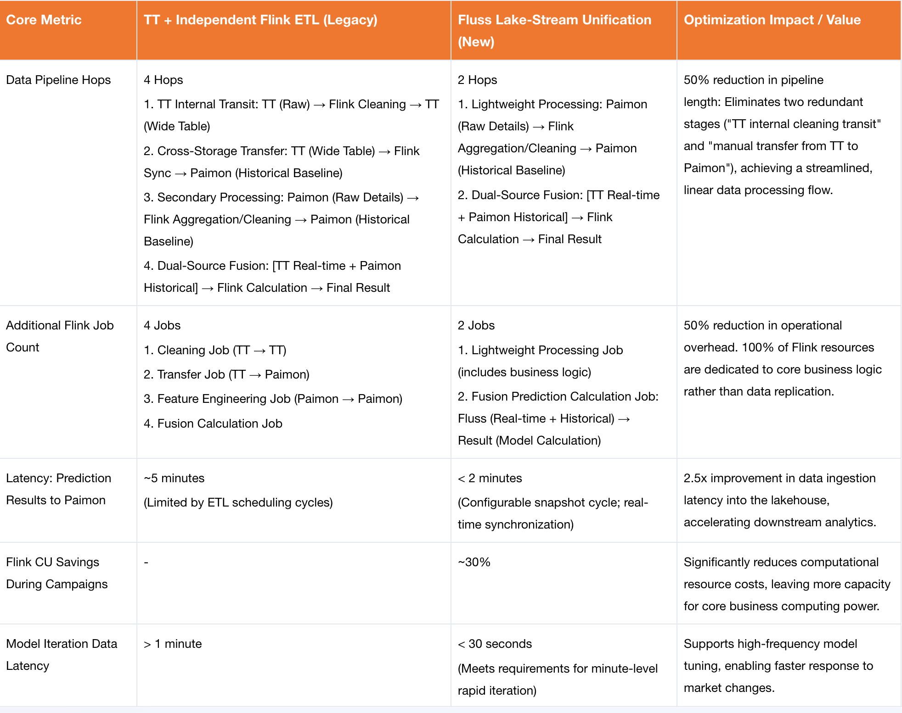

## Scenario 4: Canary Monitoring: Efficient Log Processing via Log Tables and Column Pruning
In the context of Taobao Instant Commerce’s high-frequency iteration cycle, frontend telemetry data covering the full user journey (from app launch, site entry, impressions, traffic redirection, store visits, cart additions, and orders through to fulfillment) serves as the core basis for evaluating release quality, monitoring marketing effectiveness, and optimizing search and recommendation strategies. To mitigate release risks, canary releases have become the standard procedure, with canary monitoring acting as the critical "safety valve." This process aims to detect data collection anomalies or business logic defects within seconds by real-time analysis of discrepancies between canary traffic and baseline traffic. However, facing TB-scale log throughput and millisecond-level alerting requirements, the traditional "Kafka + Flink" architecture has gradually revealed bottlenecks such as severe I/O waste, redundant pipelines, and data silos across multiple sources.

Fluss has refactored the data foundation for canary monitoring by leveraging: 
* High-throughput writes via Log Tables; 
* Server-side column pruning for I/O optimization; 
* Automatic archiving through Streaming-Lakehouse Unification.

This transformation upgrades the architecture from **reactive firefighting** to **proactive governance**.
### Pain Points of Traditional Solutions
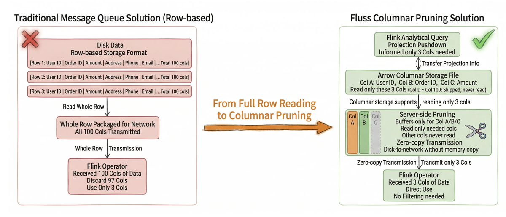

The legacy architecture utilized Kafka as the message queue, Flink for real-time consumption and computation, and Paimon for storing detailed data. However, as data volumes surged and business complexity increased, this architecture exposed several core pain points:

| **Dimension** | **Specific Technical Challenge** |
| --- | --- |
| I/O Resource Waste | Kafka carries complete message payloads with no server-side column filtering. Monitoring tasks require only ~30 core fields, yet must deserialize entire messages containing large fields like `args` (90+ columns). |
| Redundant & Complex Pipeline | Two independent Flink jobs must be maintained: one for real-time monitoring and alerting, and another for data cleaning and ingestion into Paimon. |
| Multi-Source Data Silos | Canary logs from multiple client endpoints are processed in isolation with scattered logic. |

### Architecture Based on Fluss Log Table and Column Pruning

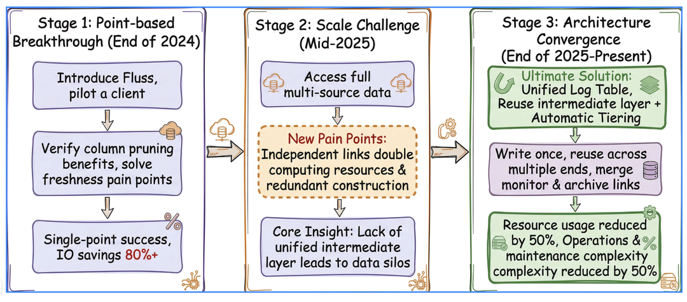

To address the aforementioned pain points, Taobao Instant Commerce underwent a three-stage architectural evolution, ultimately establishing a unified log governance solution centered on Fluss:
* **Phase 1:** Introduced Fluss for a specific client’s data to validate the feasibility of cost optimization and improvements in data freshness. 
* **Phase 2:** Integrated data from all client endpoints. While this achieved unified data ingestion, computational tasks remained redundant due to difficulties in reusing the intermediate layer. 
* **Phase 3:** Leveraged Fluss’s server-side column pruning to eliminate invalid I/O, and used automatic Tiering to merge monitoring and synchronization pipelines. This completely resolves the issue of redundant computations.

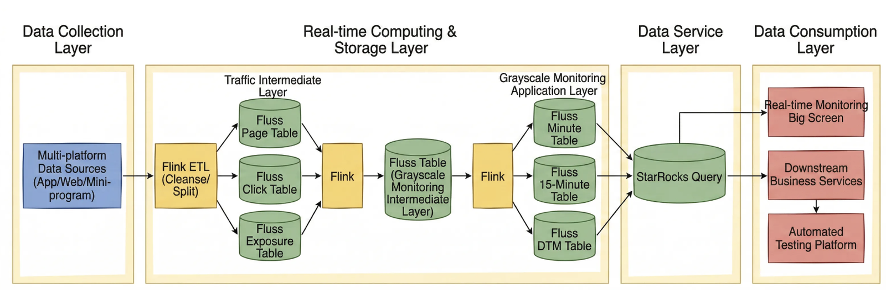

The new architecture establishes Fluss Log Tables as the single source of truth, creating an efficient **write once, multi-dimensional reuse** data loop:
* **Unified High-Throughput Ingestion:** Multi-source canary logs are uniformly written into Fluss Log Tables. Leveraging the Append-Only nature of Log Tables, the system perfectly accommodates high-concurrency write scenarios for massive volumes of logs. 
* **Server-Side Column Pruning:** During Flink consumption, Projection Pushdown pushes the required columns down to the Fluss server side. The server reads and returns only the specified **30 core fields**, blocking **67%** of invalid network transmission at the source.
* **Automated Archiving via Streaming-Lakehouse Unification:** By simply enabling the `table.datalake.enabled` configuration, the system automatically and asynchronously synchronizes real-time data to Paimon. This eliminates the need for deploying separate Flink archiving jobs. Real-time monitoring and offline analysis share the same data pipeline, achieving seamless stream-batch data fusion.
* **Multi-Client Reuse & Within-Seconds Alerting:** Real-time monitoring tasks directly consume the lightweight, pruned data stream, feeding BI dashboards to achieve within-seconds anomaly alerting. Offline analysis queries Paimon tables directly, ensuring inherent consistency between streaming and batch data.

### Core DDL and Write Implementation

```sql
-- Note: ${xxx} represents environment-specific parameters. 
-- Actual deployment values should be evaluated based on cluster scale and data volume.

CREATE TABLE `fluss_catalog`.`db`.`log_page_ri`
(
    `col1` STRING,
    `col2` STRING,
    `col3` STRING,
    `col4` STRING
    -- ....... Intermediate fields omitted
    ,ds STRING
)
    COMMENT 'Page View Log Stream'
PARTITIONED BY (ds) -- Partition key defined above
WITH (
  'bucket.num' = '${BUCKET_NUM}',
  'table.auto-partition.enabled' = 'true',
  'table.auto-partition.time-unit' = 'day',
  'table.auto-partition.key' = 'ds',
  'table.auto-partition.num-precreate' = '0', 
  'table.auto-partition.num-retention' = '1',
  'table.log.ttl' = '${LOG_TTL}',
  'table.replication.factor'='${REPLICATION_FACTOR}',
  'table.log.arrow.compression.type' = 'zstd',
  'table.datalake.enabled' = 'true', -- Enable Streaming-Lakehouse Unification
  'table.datalake.freshness' = '3min' -- Control lake table data freshness
)
;

-- Monitoring Query (Reads only 30 core columns to trigger server-side column pruning)
INSERT INTO `fluss_catalog`.`db`.ads_gray_monitoring_ri /*+ OPTIONS('client.writer.enable-idempotence'='false') */
SELECT
    col1,
    col2,
    col3,
    col4,
    -- ......... Intermediate fields omitted
    ds
FROM `fluss-ali-log`.`db`.`log_page_ri`
WHERE KEYVALUE(`args`, ',', '=', 'release_type') = 'grey' -- Canary release flag
;

-- Flink Cube Aggregation
INSERT INTO `fluss_catalog`.`db`.ads_gray_monitoring_permm_ri /*+ OPTIONS('client.writer.enable-idempotence'='false') */
SELECT
    col1,
    col2,
    col3,
    col4,
    count(*) AS pv,
-- ......... Intermediate fields omitted
```

### Measured Results
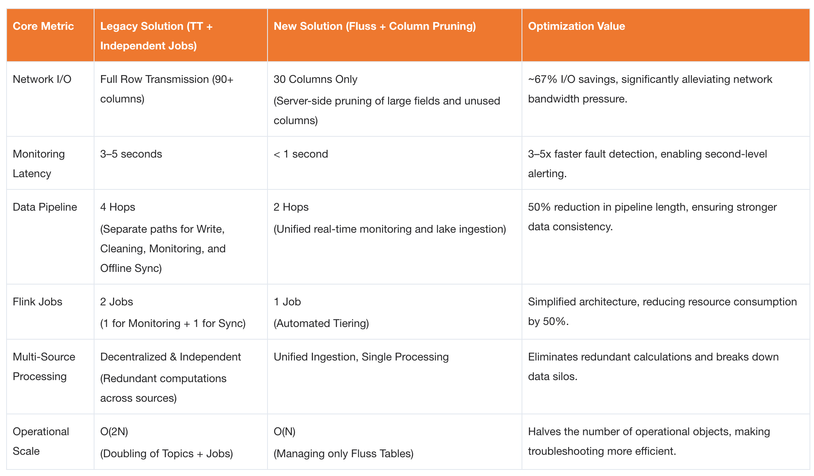


## Scenario 5: Global Real-Time UV Statistics: Auto-Increment Columns and Aggregation Tables for Unique User Counting

In Taobao Instant Commerce’s refined operational framework, unique visitor (UV) counts across the full user journey (covering impressions, visits, clicks, and orders) are core metrics for measuring traffic quality and conversion efficiency. In the original architecture, a hybrid stack of Flink + Hologres + Paimon + StarRocks was used:
* Hologres (Alibaba Cloud’s real-time OLAP database) stored user mapping tables to handle ID resolution;
* Flink constructed Bitmaps via custom user-defined functions (UDFs) and wrote them to Paimon;
* StarRocks accelerated queries using materialized views.

However, under ultra-large-scale data volumes, this architecture exposed three critical pain points:
* Lookup hotspots and latency spikes in Hologres;
* Backpressure from unbounded Flink state growth;
* High data synchronization latency from Paimon’s compaction model.

These issues made it impossible to achieve within-seconds real-time monitoring during promotional events. The introduction of Fluss marks a key iteration of this architecture:
* It replaces Hologres with Fluss KV Tables for low-latency ID mapping;
* It replaces Flink state with Fluss Aggregation Tables for stateless local aggregation;
* It replaces the independent Paimon synchronization pipeline with Auto Tiering for within-seconds sync.

This solution achieves an architectural upgrade from a fragmented, high-latency multi-component stack to a unified, low-latency Streaming-Lakehouse architecture.

### Pain Point of the Old Approach
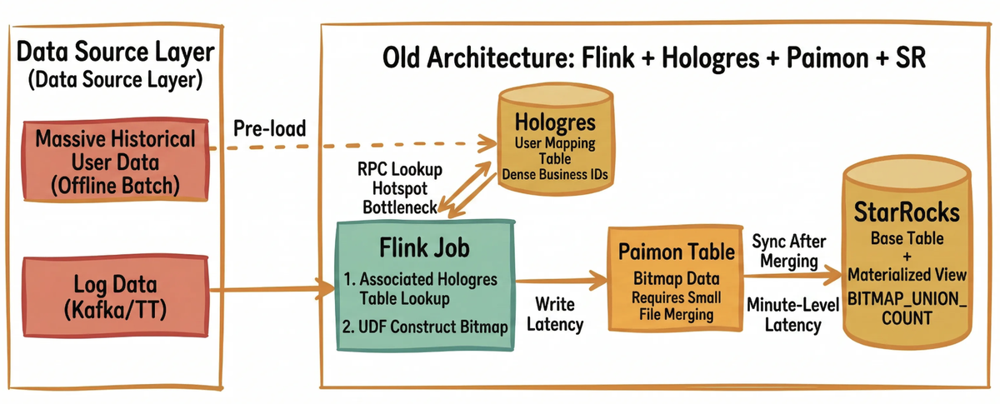
The pre-iteration architecture suffered from the following critical bottlenecks:
* **Hologres Lookup Hotspots and Network Bottlenecks:** Flink issued massive volumes of RPC requests to Hologres. Under high concurrency, this led to data skew and hotspots, causing lookup latency to degrade to several seconds. 
* **Unbounded Flink State Growth and Checkpoint Failures:** Flink UDFs were required to maintain **TB-scale** Bitmap state. This resulted in excessively long `Checkpoint` durations (**>10 minutes**), frequent timeouts, and poor job stability.
* **Paimon Synchronization Latency:** Paimon `compaction` introduced minute-level latency, leaving downstream StarRocks Materialized Views with stale data. This made it impossible to meet the requirements for within-seconds monitoring.

### Architecture Based on Fluss Auto-Increment Columns and Aggregation Tables
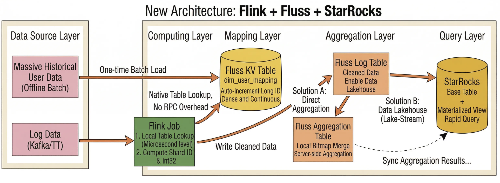

To address the three major pain points of the traditional architecture, we leveraged Fluss’s core design with a strategy centered on "mapping sparse business IDs to dense integer IDs for bitmap computation." Through techniques such as full pre-loading, dense integer ID generation, sharded parallelism, and 32-bit bitmap optimization, we achieved high-performance real-time unique visitor counting.

* **Auto-Increment KV Mapping Layer:** Using Flink’s built-in dimension table lookup, we built real-time ID resolution capabilities:
  * **Lock-Free Segment Allocation:** Fluss requests ID segments in batches and caches them locally. This lock-free, thread-level allocation avoids lock contention and GC pauses during concurrent writes, significantly improving ID generation throughput.
  * **Query-Then-Insert:** In dimension table Lookup scenarios, if a business ID is not found, Fluss automatically triggers an `INSERT` and returns the new auto-increment ID. This mechanism merges the traditional "check-then-write" two-step interaction into a single request, effectively reducing network traffic and cluster pressure.
  * **Batching & Pipeline Optimization:** By combining Flink’s asynchronous Lookup batch request mechanism with Fluss client-side Pipeline writes, massive discrete RPCs are aggregated and processed in parallel. This design reduces interaction overhead and further optimizes overall system throughput.
  * **Full Pre-loading & Dense ID Generation:** Before going live, billions of historical business IDs were batch-imported into the Fluss KV Table to generate unique 64-bit integer IDs using the auto-increment column. This eliminates cross-cluster RPC latency for existing users (**100% cache hit rate**), while new users are assigned IDs on first appearance via `INSERT`.
* **Sharded Parallelism:** By taking the modulus of the physical ID, all users are uniformly distributed across N logical shards, enabling localized parallelism for global deduplication tasks. Since behaviors from the same user strictly fall into the same shard, data volume across shards remains absolutely balanced, completely avoiding hotspot skew caused by patterns in business ID ranges. 
* **32-Bit ID Compression:** When the total number of physical IDs is below 4 billion, 64-bit IDs can be downcast to 32-bit integers, enabling the use of the `rbm32` (32-bit RoaringBitmap) aggregation function. Compared to `rbm64`, this reduces memory usage by over **50%** and significantly improves bitwise operation efficiency and CPU cache utilization.

#### Dual-Path Aggregation Architecture

Based on the aforementioned preprocessing, the team implemented two parallel data pipelines: 
* **Option A (Fluss Aggregation Table Pre-Aggregation):** The server side performs local Bitmap merging keyed by `(ds, hh, mm, shard_id)`, allowing Flink to consume only the already-merged results. This offloads the computational work to the storage layer and is ideal for extreme real-time scenarios such as live event war rooms, achieving sub-second latency.
* **Option B (Fluss Auto Tiering + StarRocks Native Deduplication):** Detailed data is synchronized to Paimon within seconds, with StarRocks handling the final deduplication. This approach suits flexible multi-dimensional analysis (such as daily operational dashboards) and supports ad-hoc queries across arbitrary dimensions.

Both paths share the same ID mapping and sharding logic, allowing the team to freely switch between them based on business requirements for real-time performance versus query flexibility.
### Core DDL and Write Implementation

#### User Mapping Table (with Auto-Increment Column Enabled)

```sql
-- Note: ${xxx} represents environment-specific parameters. 
-- Actual deployment values should be evaluated based on cluster scale and data volume.

CREATE TABLE `fluss_catalog`.`db`.`user_mapping_table` (
  user_id BIGINT COMMENT 'Original User ID',
  uid_int64 BIGINT COMMENT 'Auto-incremented Globally Unique Integer ID', 
  update_time TIMESTAMP(3) COMMENT 'Update Time',
  PRIMARY KEY (user_id) NOT ENFORCED
) WITH (
  'bucket.key' = 'user_id',
  'bucket.num' = '${BUCKET_NUM}',
  'auto-increment.fields' = 'uid_int64', -- Enable auto-increment column
  'table.log.arrow.compression.type' = 'zstd'
);
```
#### New User Discovery and Mapping Ingestion
```sql
INSERT INTO `fluss_catalog`.`db`.`user_mapping_table` (user_id) 
SELECT /*+ REPLICATED_SHUFFLE_HASH(t2) */ 
  t1.user_id
FROM `fluss_catalog`.`db`.`log_exp_ri` t1
LEFT JOIN `fluss_catalog`.`db`.`user_mapping_table` 
 /*+ OPTIONS(
    'lookup.insert-if-not-exists' = 'true',
    'lookup.cache' = 'PARTIAL',
    'lookup.partial-cache.max-rows' = '500000',
    'lookup.partial-cache.expire-after-write' = '1h',
    'lookup.partial-cache.cache-missing-key' = 'false'
) */
FOR SYSTEM_TIME AS OF PROCTIME() AS t2 
ON t1.user_id = t2.user_id
GROUP BY t1.user_id;
```

#### Implementation of Solution A: Fluss Aggregation Table + Flink Global Merge
Core Idea: Use the Fluss Aggregation Table to perform partial Bitmap merging on the server side, so Flink only needs to consume the pre-aggregated results for a final global merge.

**Fluss DDL (Aggregation Table)**
```sql
-- Note: ${xxx} represents environment-specific parameters. 
-- Actual deployment values should be evaluated based on cluster scale and data volume.
CREATE TABLE IF NOT EXISTS `fluss_catalog`.`db`.`ads_uv_agg` (
    ds STRING COMMENT 'Date partition yyyyMMdd',
    hh STRING COMMENT 'Hour HH',
    mm STRING COMMENT 'Minute mm',
    shard_id INT COMMENT 'Shard ID',
    uv_bitmap BYTES COMMENT 'Minute-level user bitmap',
    PRIMARY KEY (ds, hh, mm, shard_id) NOT ENFORCED
) 
PARTITIONED BY (ds)
WITH (
    'bucket.key' = 'shard_id',
    'bucket.num' = '${BUCKET_NUM}',
    'table.merge-engine' = 'aggregation',  -- Enable aggregation engine; otherwise, Bytes fields cannot be automatically merged
    'fields.uv_bitmap.agg' = 'rbm32', -- Specify that the Bytes field uses the rbm32 algorithm for Union aggregation
    'table.auto-partition.enabled' = 'true',
    'table.auto-partition.time-unit' = 'day',
    'table.auto-partition.key' = 'ds'
);
```
**Fluss DML (Aggregation Table)**
```sql
-- Note: N is a power of 2 and should be dynamically configured based on cluster scale.
INSERT INTO fluss_catalog.db.ads_uv_agg
SELECT
  t1.ds 
  ,t1.hh 
  ,t1.mm 
  ,CAST(t2.uid_int64 % N AS INT) AS shard_id
  ,BITMAP_TO_BYTES(BITMAP_BUILD_AGG(CAST((t2.uid_int64 / N) AS INT))) AS uv_bitmap
FROM `fluss_catalog`.`db`.`log_exp_ri` t1
LEFT JOIN `fluss_catalog`.`db`.`user_mapping` 
  /*+ OPTIONS('lookup.cache' = 'PARTIAL','lookup.partial-cache.max-rows' = '500000') */
  FOR SYSTEM_TIME AS OF PROCTIME() AS t2 
ON t1.user_id = t2.user_id
GROUP BY t1.ds, t1.hh, t1.mm, CAST(t2.uid_int64 % N AS INT)
;
```

#### Implementation of Solution B: Fluss Auto Tiering + StarRocks Native Deduplication
Core Idea: Fluss acts as a high-throughput data pipeline, synchronizing data to Paimon via Auto Tiering. StarRocks then handles the final deduplication using its native OLAP engine.

**Fluss DDL (Log/KV Table with Tiering):**
```sql
CREATE TABLE fluss_catalog.db.ads_uv_detail (
    ds STRING,
    -- ....... Intermediate fields omitted
    shard_id INT,
    uid_int32 INT,
    PRIMARY KEY (ds, shard_id, uid_int32) NOT ENFORCED
) WITH (
    'table.datalake.enabled' = 'true', -- Enable Streaming-Lakehouse Unification
    'table.datalake.freshness' = '10s' -- Second-level synchronization
);
```

**Fact Table Denormalization (Generating Shard ID and Bitmap Index)**
```sql
-- Note: N is a power of 2 and should be dynamically configured based on cluster scale.
INSERT INTO fluss_catalog.db.ads_uv_detail
SELECT
  t1.ds,
  -- ....... Intermediate fields omitted
  CAST(t2.uid_int64 % N AS INT) AS shard_id,      -- Shard ID, used for parallel aggregation
  CAST((t2.uid_int64 / N) AS INT) AS uid_int32   -- Compressed ID, used for Bitmap
FROM `fluss_catalog`.`db`.`log_exp_ri` t1
LEFT JOIN `fluss_catalog`.`db`.`user_mapping` 
  /*+ OPTIONS('lookup.cache' = 'PARTIAL','lookup.partial-cache.max-rows' = '500000','lookup.partial-cache.expire-after-access' = '2min') */
  FOR SYSTEM_TIME AS OF PROCTIME() AS t2 
ON t1.user_id = t2.user_id;
```

**Downstream StarRocks Precise Deduplication Query**
```sql
-- Note: ${xxx} in the text represents environment-specific parameters. Actual deployment requires evaluation based on cluster scale and data volume.
-- Create a materialized view to accelerate queries
CREATE MATERIALIZED VIEW mv_global_uv AS
SELECT 
  t.ds,
  SUM(t.rb_partial) as rbm_user_count -- Globally merge partial Bitmaps from each shard
FROM (
  SELECT 
    ds,
    shard_id, 
    BITMAP_UNION_COUNT(TO_BITMAP(uid_int32)) as rb_partial -- Partial Bitmap count
  FROM 
    paimon_catalog.db.ads_uv_detail
  WHERE 
    ds = '${date}'
  GROUP BY 
    ds, shard_id
) t
GROUP BY t.ds;
```

**Features: Decoupled architecture; StarRocks bears the computational load and supports flexible ad-hoc queries.**

### Measured Results
Compared to the legacy solution, both new approaches achieve significant optimizations, but with different focuses:
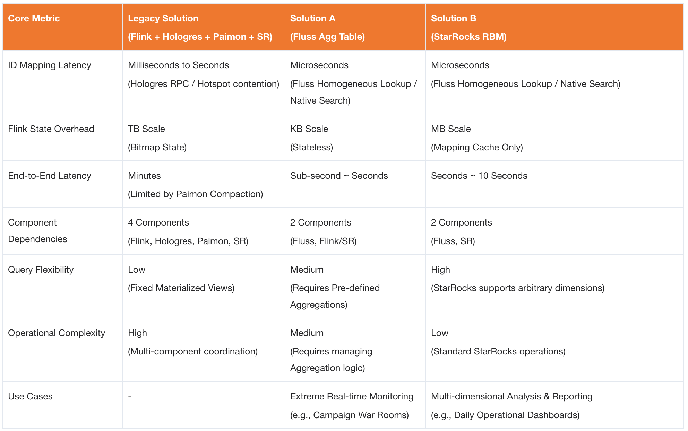

* If the business prioritizes extreme real-time performance and has fixed aggregation logic, Solution A is recommended, as it pushes the computational load down to the storage layer to the greatest extent. 
* If the business requires flexible multi-dimensional analysis and can tolerate a few seconds of latency, Solution B is recommended, as it fully leverages StarRocks' OLAP capabilities and results in a simpler, more general-purpose architecture.

By adopting these two solutions, Taobao Instant Commerce successfully achieved real-time, accurate, and cost-effective end-to-end unique visitor (UV) metrics at massive scale. This approach retains StarRocks' query strengths while resolving the upstream pipeline performance bottlenecks through Fluss.

## Fluss Implementation Best Practices and Future Roadmap
During the rollout of Fluss, Taobao Instant Commerce progressed from single-feature pilots to full pipeline implementations combining multiple Fluss features. This process has produced practical, reusable patterns while also shaping a clear technical roadmap aligned with both business needs and upstream community development.

### Key Lessons Learned
* **Prioritize DDL Standards:** When creating wide tables, plan the responsible jobs for each column in advance. All non-primary key columns must be declared as `NULLABLE`, and writers should specify only the target columns. This standard must be integrated into the team’s table creation workflow to prevent update failures caused by improper field configurations.
* **Precise Bucketing Strategy:** An insufficient number of buckets can lead to excessive data volume in a single bucket, causing read amplification in `RocksDB`.
* **Maximize Column Pruning Benefits:** Business SQL queries should explicitly specify the required columns to avoid `SELECT *`. This is particularly important in scenarios involving log wide tables and dimension table joins, allowing Fluss to fully leverage its I/O savings advantages.
* **Phased Migration:** There is no need to replace the entire traditional pipeline at once. Start by replacing large-state two-stream joins with Delta Joins, then gradually expand to Partial Update wide tables and lake-stream integration. Each step should deliver independent, quantifiable benefits, and should be promoted broadly only after its effectiveness has been verified.

## Future Roadmap

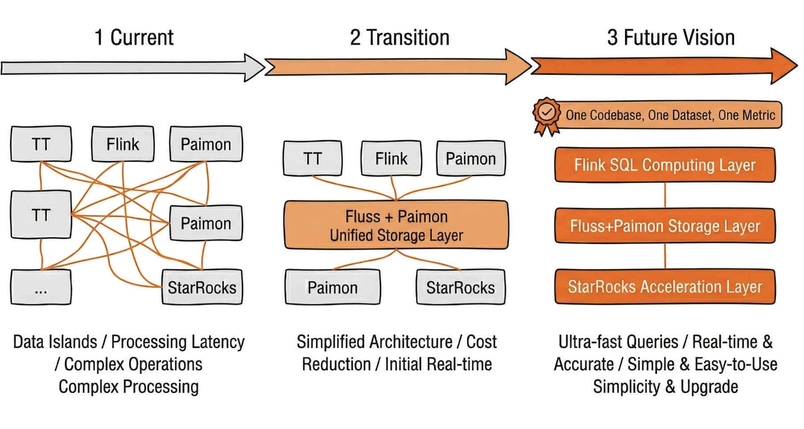

In the future, the overall data architecture will gradually unify computational logic through Flink SQL, evolve into a unified lake-stream storage foundation based on Fluss and Paimon, and build a unified query acceleration layer leveraging StarRocks.
The ultimate goal is to achieve **one codebase, one dataset, and one metric definition**, serving both real-time applications and offline analytics simultaneously, thereby thoroughly resolving data inconsistencies and high maintenance costs caused by the separation of stream and batch processing.

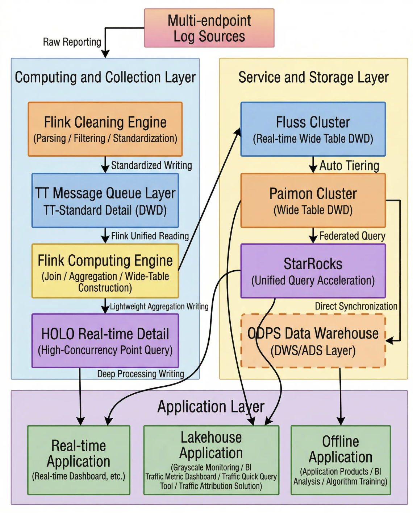
