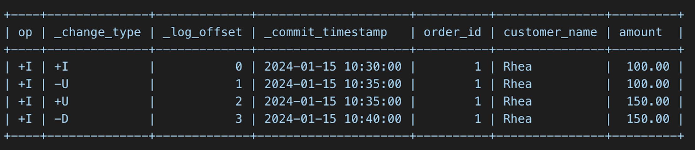

🌊 We are excited to announce the official release of **Apache Fluss (Incubating)** v0.9!

This release marks an important milestone for the project. 
0.9 significantly expands Fluss’s capabilities as a **streaming storage solution for real-time data analytics & AI**, with a strong focus on schema flexibility, richer data models, extended compute storage functionality, improved operational stability, and a more developer-friendly client experience.

Whether you’re building **unified stream & lakehouse architectures**, **real-time analytics**, **feature/context stores**, or **stateful streaming pipelines**, 
Fluss 0.9 introduces powerful new primitives that make these systems easier, safer, and more efficient to operate at scale.

<!-- truncate -->
## Support for Complex Data Types
Apache Fluss 0.9 strengthens and extends support for **complex data types** with a focus on deep nesting, safe schema evolution, and new ML-oriented use cases.
Supported types now include `ARRAY`, `MAP`, `ROW`, and `deep nesting types`.
For example, schemas such as the following:
> `ARRAY< MAP<STRING, ROW<values ARRAY<FLOAT>, ts TIMESTAMP_LTZ(3)>>>`

are now fully supported in production. These nested structures are handled as **schema-aware** rows, not opaque payloads, ensuring correctness.

Additionally, adding new columns does not affect existing jobs after clients upgrade to 0.9. Moreover, with support for the Lance format, Fluss can be used for the ingestion of multi-modal data and vector storage. Users can now store embeddings directly in tables using `ARRAY<FLOAT>` or `ARRAY<DOUBLE>`:

```sql
CREATE TABLE documents (
  doc_id BIGINT PRIMARY KEY,
  embedding ARRAY<FLOAT>
);
```

This enables new user stories where Fluss acts as the source of truth for vector embeddings, which can then be incrementally consumed by vector engines and maintain ANN indexes. Another helpful feature for such use cases included in this release is the Compacted Log Format (see below).

https://github.com/apache/fluss/issues/816

### Schema Evolution with Zero-Copy Semantics
Schema evolution is critical for long-running streaming systems, and Fluss 0.9 delivers a major step forward in this area.

The release adds support for altering table schemas by appending new columns, fully integrated with Flink SQL and Fluss DDL. For example:
```sql
ALTER TABLE orders
ADD COLUMN discount DOUBLE;
```

For more information, see [Flink DDL support](https://fluss.apache.org/docs/next/engine-flink/ddl/#alter-table).

#### Zero-copy schema evolution
Zero-copy schema evolution means that existing data files are not rewritten when a schema changes. Instead, only metadata is updated.

Existing records simply do not contain the new column, and readers interpret missing fields as NULL or default values. New records immediately include the new column without impacting historical data.

This approach avoids downtime, eliminates expensive backfills, and ensures predictable performance during schema changes. It is especially important for streaming pipelines that are expected to run continuously over long periods of time.

## Auto-Increment Columns for Dictionary Tables 
This release introduces AUTO_INCREMENT columns in Fluss, enabling Dictionary Tables, a simple pattern for mapping long identifiers (such as strings or UUIDs) to compact numeric IDs in real-time systems.

AUTO_INCREMENT columns automatically assign a unique numeric ID when a row is inserted and no value is provided. The assigned ID is stable and never changes. In distributed setups, IDs may not appear strictly sequential due to parallelism and bucketing, but they are guaranteed to be unique and monotonically increasing per allocation range.

A Dictionary Table is a regular Fluss table that uses an AUTO_INCREMENT column to map long business identifiers, such as strings or UUIDs, to compact integer IDs. In simple terms, a Dictionary Table gives every unique value a short number and always returns the same number for the same value.

```sql
CREATE TABLE uid_mapping (
    uid STRING,
    uid_int64 BIGINT,
    PRIMARY KEY (`uid`) NOT ENFORCED
) WITH (
      'table.auto-increment.fields' = 'uid_int64'
);

INSERT INTO uid_mapping VALUES ('user1');
INSERT INTO uid_mapping VALUES ('user2');
INSERT INTO uid_mapping VALUES ('user3');
INSERT INTO uid_mapping VALUES ('user4');
INSERT INTO uid_mapping VALUES ('user5');

SELECT * FROM uid_mapping;
```

| uid   | number |
| :---- | :----- |
| user1 | 1      |
| user2 | 2      |
| user3 | 3      |
| user4 | 4      |
| user5 | 5      |

Dictionary Tables are commonly used to answer operational questions such as:
* How many unique users, devices, or sessions have we seen so far? 
* Is this the first time we are seeing this identifier? 
* Have we already processed this event?; 
* What is the current set of active entities/sessions?

They also help keep identity-related state manageable over long periods and provide a shared, consistent ID mapping that can be reused across systems.

## Aggregation Merge Engine
Apache Fluss now supports storage-level aggregations via a new Aggregation Merge Engine, enabling real-time aggregation to be pushed down from the compute layer into the Fluss storage layer.

Traditionally, real-time aggregations are maintained in Flink state, which can lead to:
* Large and growing state size 
* Slower checkpoints and recovery 
* Limited scalability for high-cardinality aggregations
  
With the Aggregation Merge Engine, aggregation state is externalized to Fluss, allowing Flink jobs to remain nearly stateless while Fluss efficiently maintains aggregated results.
```sql
CREATE TABLE campaign_uv (
    campaign_id STRING,
    uv_bitmap BYTES,
    total_events BIGINT,
    last_event_time TIMESTAMP,
    PRIMARY KEY (campaign_id) NOT ENFORCED
) WITH (
    'table.merge-engine' = 'aggregation',
    'fields.uv_bitmap.agg' = 'rbm64',
    'fields.total_events.agg' = 'sum',
    'fields.last_event_time.agg' = 'last_value_ignore_nulls'
);
```

Maintain continuously updated metrics (for example, order counts or model aggregated features) directly in Fluss tables, while Flink focuses only on event ingestion and lightweight processing.

The aggregation merge engine is another step towards Fluss’s compute storage separation, which you can find more about [here](https://www.ververica.com/blog/introducing-the-era-of-zero-state-streaming-joins?hs_preview=cdhHvcIE-199898654106).

Design reference:
https://cwiki.apache.org/confluence/display/FLUSS/FIP-21%3A+Aggregation+Merge+Engine

## Support for Compacted LogFormat
By default, Fluss uses Apache Arrow–based columnar storage, which is ideal for analytical workloads with selective column access. However, some workloads do not benefit from columnar layouts, especially when all columns are read together.
Fluss 0.9 introduces support for a Compacted LogFormat to address these cases.
This format is designed for tables such as aggregated result tables and large vector or embedding tables, where full-row reads are the dominant access pattern. In these scenarios, columnar storage provides limited benefit and can introduce unnecessary overhead.

The Compacted LogFormat stores rows in a tightly packed, compact representation on disk, resulting in:
* Reduced disk footprint for wide rows 
* More efficient full-table and wide-row scans 
* Better storage efficiency for derived and materialized tables

Arrow remains the default and preferred choice for column-pruned analytical workloads, while the Compacted LogFormat provides a more efficient option for full-row, compacted datasets.
[Link to the docs]

## KV Snapshot Lease
Apache Fluss now supports KV Snapshot Lease, improving the reliability of snapshot-based reads for streaming and batch workloads.

Fluss tables periodically generate KV snapshots that are used by readers (for example, Flink jobs) as a consistent starting point before continuing with incremental changelog consumption. Previously, snapshot cleanup was driven solely by retention policies and was unaware of whether a snapshot was actively being read. As a result, snapshots could be deleted while a job was still reading them, leading to job failures and making clean restarts impossible in some cases.

With KV Snapshot Leases, snapshot lifecycle management becomes consumer-aware. Readers explicitly acquire a lease when they start reading a snapshot, which prevents that snapshot from being deleted while it is in use. Leases are periodically renewed during long-running reads, and snapshots are only eligible for cleanup once all associated leases have been released or have expired. This ensures snapshots remain available for the full duration of a read, while still allowing automatic cleanup if a reader crashes or stops renewing its lease.

This feature makes snapshot-based reads safe and predictable, enabling reliable snapshot + changelog consumption, large table bootstrapping, and long-running snapshot scans without requiring overly conservative snapshot retention settings.

More information:
https://cwiki.apache.org/confluence/display/FLUSS/FIP-22+Support+Kv+Snapshot+Lease

## Cluster Rebalance
Apache Fluss now supports cluster rebalancing, enabling automatic redistribution of buckets and leaders across TabletServers to maintain balanced load and efficient resource utilization.

**Highlights**
* On-demand rebalancing for common operational scenarios:
  * Scaling up or down the cluster 
  * Decommissioning TabletServers 
  * Planned maintenance 
  * Resolving load imbalance


* Goal-driven rebalance with prioritized objectives:
  * REPLICA_DISTRIBUTION to balance replicas 
  * LEADER_DISTRIBUTION to balance leaders


* Server-aware rebalancing using tags:
  * PERMANENT_OFFLINE for decommissioning 
  * TEMPORARY_OFFLINE for maintenance scenarios

* Operational visibility and control:
  * Track rebalance progress and status 
  * Cancel an in-progress rebalance if needed 
  * Only one rebalance operation runs at a time per cluster 
  
This feature simplifies cluster operations, improves stability during topology changes, and helps ensure consistent performance as Fluss clusters scale. 
More information on the docs [link to the docs]
https://github.com/swuferhong/fluss/blob/a94b6db0859c938e3e49b1d1e630165dfdaabf78/website/docs/maintenance/operations/rebalance.md

## Virtual Tables 
Apache Fluss 0.9 introduces Virtual Tables, a new system-level abstraction  
that provides access to metadata, change data, and other system information     
without storing additional data. Virtual tables are accessed by appending a     
suffix to the base table name, offering a clean and intuitive way to interact   
with internal data streams.

The first virtual table type introduced in this release is the $changelog table,
which exposes the raw changelog stream of any Fluss table. By simply appending
$changelog to a table name, users can access a complete audit trail of every    
data modification, including inserts, updates, and deletes, along with rich metadata.

- - - - Access the changelog of any table

```sql
SELECT * FROM orders$changelog;
```


Each changelog record includes three metadata columns prepended to the original
table columns:
- **_change_type**: The type of change operation (+I for insert, -U/+U for update before/after, -D for delete, or +A for log table appends)                       
- **_log_offset**: The position in the log, useful for tracking and replay          
- **_commit_timestamp**: The exact timestamp when the change was committed

Support for Both Primary Key and Log Tables

The $changelog virtual table works with both table types in Fluss:

Primary Key Tables emit the full spectrum of change types (+I, -U, +U, -D), enabling precise tracking of inserts, updates, and deletes.                     
Log Tables (append-only) emit +A for every appended row, providing a structured view of the append stream with offset and timestamp metadata.

Flexible Startup Modes

Users can control where the changelog reading begins using startup modes:

earliest: Read from the beginning of the log for full history replay          
latest: Read only new changes from the current position for real-time monitoring                                                                      
timestamp: Start from a specific point in time for targeted replay


The $changelog virtual table unlocks several real-time use cases:

ML/AI (Feature Store): Stream only changed records to feature stores, process deltas instead of recomputing entire datasets. Perfect for keeping embeddings, feature vectors, and RAG systems fresh without full refreshes.                                                           
Audit Trails: Build comprehensive audit logs with timestamps and offsets. Immutable append-only audit logs showing what changed, when, and by whom are critical for AI explainability and regulatory requirements

## Dynamic Sink Shuffle For Partition Table

Fluss supports two typical write strategies. The first is a shuffle-based approach that relies on downstream bucket IDs. While this method achieves effective batching, it encounters a bottleneck when writing to a single bucket with a single concurrency, as increasing parallelism does not mitigate the issue. The second strategy employs Flink's round-robin distribution, which, when writing to log tables, results in high metadata overhead and low actual data volume. This leads to inefficient read performance and an excessive number of Sink connections (each sink must establish connections with all Fluss servers). For multi-partition tables, uneven traffic distribution further amplifies these challenges.

The newly introduced dynamic shuffle for partitioned tables dynamically detects traffic distribution across partitions at runtime. It allocates the number of write nodes proportionally based on traffic levels — high-traffic partitions are assigned more sink nodes, while low-traffic partitions are allocated fewer nodes. This ensures that each sink is responsible for writing to only one or a small number of buckets, significantly enhancing batching efficiency. Even in scenarios with uneven partition traffic, the write traffic for each sink remains balanced, ensuring optimal performance.

## Other Important Features:
- **Java Client Pojo Support**
- **Azure FS**
- **Flink 2.2 Support**: Support `ALTER TABLE ... SET ('datalake.freshness' = ...)`
- **Spark Engine**: Support for catalogs, stream/batch read, and stream/batch write.

## More Improvements
* [Add RocksDB Block Cache Configuration Options for Index and Filter Blocks](https://github.com/apache/fluss/issues/2393)
* [Add an implementation of AutoIncIDBuffer](https://github.com/apache/fluss/pull/2161) 
* [Add roaring bitmap aggregation](https://github.com/apache/fluss/pull/2390) 
* [Refactor LanceArrowWriter](https://github.com/apache/fluss/issues/1569)
* [Support Flink 2.2 Support alter table.datalake.freshness](https://github.com/apache/fluss/pull/2365)
* [Flink CALL producers to update cluster configs dynamically](https://github.com/apache/fluss/pull/2279)
* [WAL mode for changelog images of primary key table](https://github.com/apache/fluss/pull/2105)
* [Report rich RocksDB metrics for debugging and production-ready usage](https://github.com/apache/fluss/pull/2282
* [Improved stability for primary-key tables under spiky write throughput through rate limiting and memory usage control for statistics](https://github.com/apache/fluss/pull/2178]
* [Improve stability for large datalake enabled tables with more than 10K buckets](https://github.com/apache/fluss/issues/2224)
* [Fix correctness issue in union reads of Paimon tables with deletion vectors](https://github.com/apache/fluss/pull/2326) 
* Fluss no longer requires the three system columns (`__offset`, `__timestamp`, and `__bucket`) on lakehouse tables. This reduces intrusiveness into users’ existing lakehouse systems and makes it easier to upgrade an existing lakehouse table to a streaming lakehouse table. (https://github.com/apache/fluss/pull/2417)
